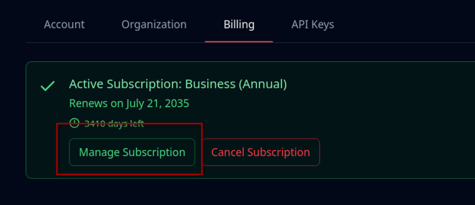

# Billing

## Accessing the Billing Page

1. Go to [app.mindee.com](https://app.mindee.com/)
2. On the left-hand menu, click on **Settings**
3. Select the **Billing** tab

Or simply click here: <a href="https://app.mindee.com/settings?tab=billing" class="button primary">Go to Billing page</a>

Only **Organization Admins** can access and modify billing details.

## Manage Billing Settings

From the **Billing** tab, you can:

* View your current subscription
* Switch billing frequency (monthly or annual)
* Access your Stripe customer portal

### Upgrading or Changing Plans

To change your plan:

1. Go to **Settings** → **Billing**
2. Choose a new plan under the available options
3. Click on **Downgrade** or **Upgrade**

## Stripe Customer Portal

To access your Stripe customer portal, click on the "Manage Subscription" button.

<figure><figcaption></figcaption></figure>

### Invoices

You can download past invoices anytime on your Stripe account.


Invoices are issued automatically at the start of each billing period.


## Supported Payment Methods

You can use any payment method supported by Stripe for all self-serve plans.

Among these, the most popular are credit and debit cards.

Custom payment options are available for Enterprise customers.

## Included Pages and Overages

Each plan includes a monthly or a yearly quota depending on your subscription frequency. There is no service disruption if you reach the quota.

If you exceed the included pages in your plan, these will be charged according to the Overage Rate. These extra calls will be invoiced every €100, or at the end of your subscription.

| Plan     | Included Pages | Overage Rate  |
| -------- | -------------- | ------------- |
| Starter  | 6,000 / year   | €0.05 / page  |
| Pro      | 30,000 / year  | €0.04 / page  |
| Business | 120,000 / year | €0.035 / page |


**Pages are calculated based on successfully processed documents.**

Client errors (HTTP 4xx) and processing errors will **not** count towards your page usage.


To track your page usage, you can consult the [insights.md](insights.md "mention") page.

Additionally, API responses contain the number of pages processed in the [#file-metadata](../integrations/client-libraries-sdk/process-the-response.md#file-metadata "mention") object.

You will be billed as soon as you complete your subscription payment online.

Payment is required upfront to access the platform and the features included in your plan.

Enterprise customers have different billing methods, please reach out to us directly.
