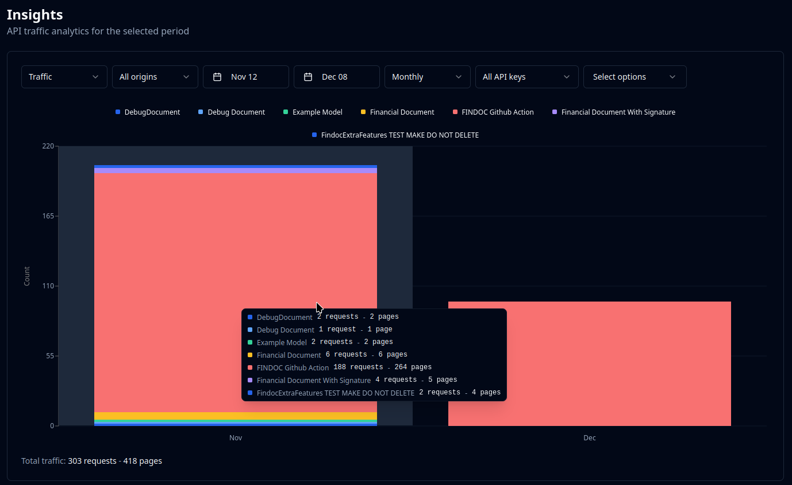
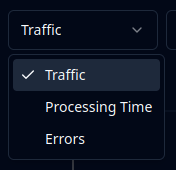
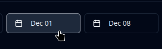
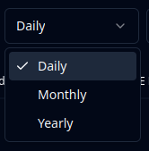
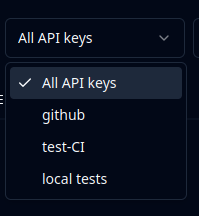
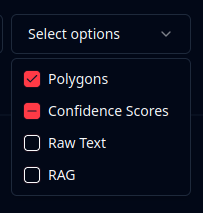

# Insights

## Overview

The insights page allows you to view various data concerning your usage of the Mindee platform and API.

<figure><figcaption></figcaption></figure>

## Accessing the Insights Page

1. Go to [app.mindee.com](https://app.mindee.com/)
2. On the left-hand menu, click on **Insights**

Or simply click here:

<a href="https://app.mindee.com/insights" class="button primary">Go to Insights page</a>

## Data Views

<figure><figcaption></figcaption></figure>

The following data are available for viewing.

* Traffic: the number of calls and the number of pages processed.
* Processing Time: the average time requests take to process, in seconds.
* Errors: the number of processing (inference) errors.\
  Note: does not show user errors (HTTP 4xx).

## Data Filters

For all data views, the following filters are available.

#### Origin

Filter based on the origin of the request.

<figure><figcaption></figcaption></figure>

"Live Test" is when using the [live test](../models/live-test.md) functionality on the platform.

"API" is for any request made using an API key.

#### Date Range

Filter based on start and end dates.

<figure><figcaption></figcaption></figure>

#### Group By

Only affects the visualization, group results by day, month, or year.

<figure><figcaption></figcaption></figure>

#### API Key

Show all API keys or filter on a specific one.

<figure><figcaption></figcaption></figure>

#### Options Used

Filter by [optional features](../models/optional-features/) activated in the call.

<figure><figcaption></figcaption></figure>

3 states to choose:

* empty: no filter
* check mark: show only calls with the option **active**
* minus sign: show only calls with the option **inactive**
