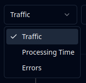
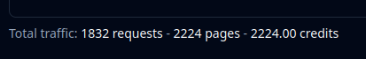
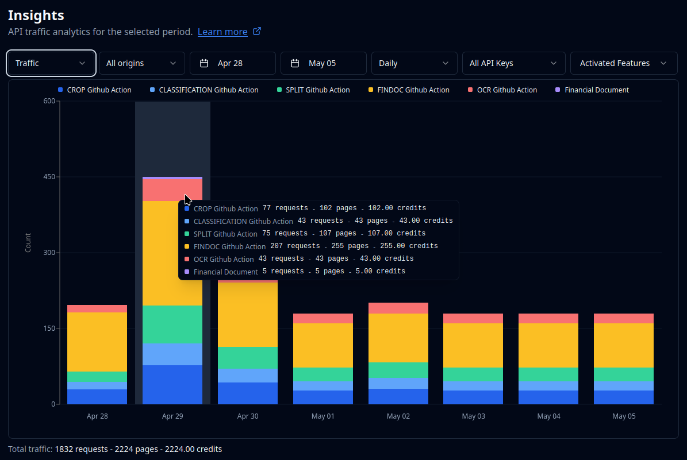
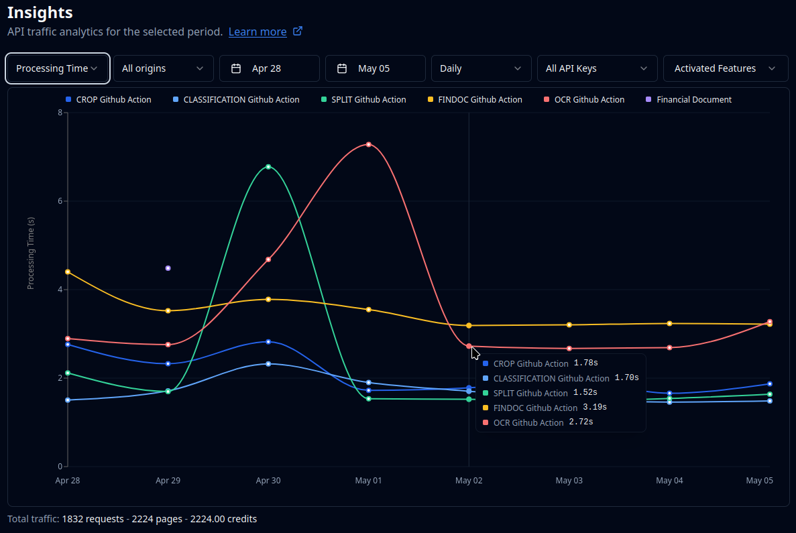
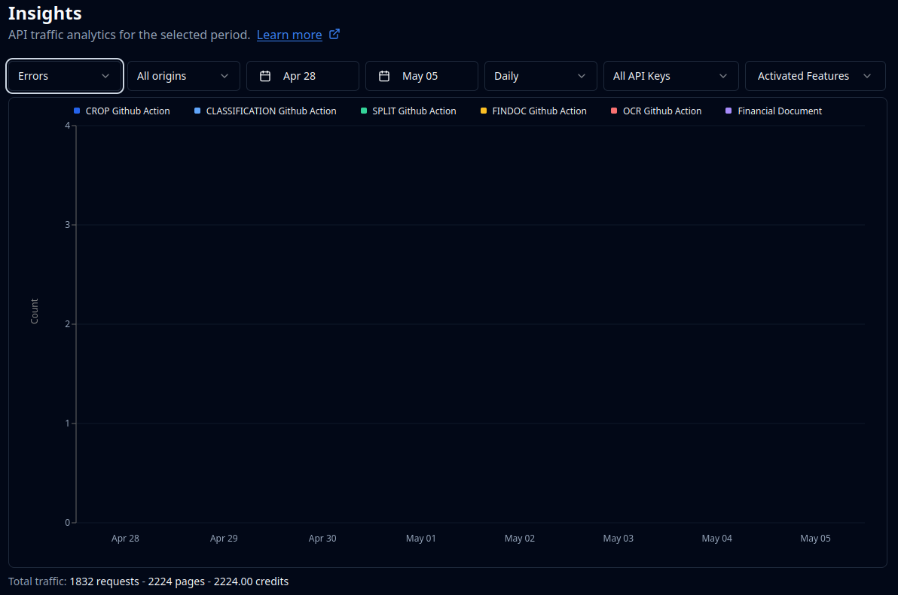
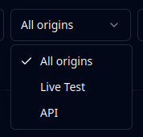
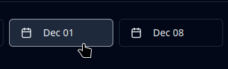
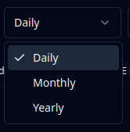
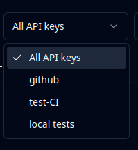
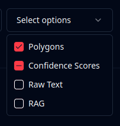

# Insights

## Overview

Use the insights page to view all of your requests over a given period.

Notably, you can keep track of your credit usage.

## Access the Insights Page

1. Go to [app.mindee.com](https://app.mindee.com/)
2. On the left-hand menu, click on **Insights**

Or simply click here: <a href="https://app.mindee.com/insights" class="button primary">Go to Insights page</a>

## Data Views

Selecting the Data View is done at the top of the page:

<figure><figcaption></figcaption></figure>

All Data Views will show the total usage, at the bottom of the page:

<figure><figcaption></figcaption></figure>

### Traffic View

The number of calls and the number of pages that were successfully processed.

This does not include calls that resulted in an error.

These requests count towards your plan's credit usage, the number of credits consumed is shown.

<figure><figcaption></figcaption></figure>

### Processing Time View

The average time requests take to process, in seconds.

Processing time is calculated from when the request was received to when the inference was finished.

<figure><figcaption></figcaption></figure>

### Errors View

The number of processing (inference) errors.

Does not include user errors (HTTP 4xx), since these requests get rejected before any processing takes place.

**Errors do not count towards your plan's credit usage.**

<figure><figcaption></figcaption></figure>

## Data Filters

For all data views, the following filters are available.

### Origin Filter

Filter based on the origin of the request.

<figure><figcaption></figcaption></figure>

"Live Test" is when using the [live test](../models/live-test.md) functionality on the platform.

"API" is for any request made using an API key.

### Date Range Filter

Filter based on start and end dates.

<figure><figcaption></figcaption></figure>

### Group By

Only affects the visualization. Group results by day, month, or year.

<figure><figcaption></figcaption></figure>

### API Key Filter

Show all API keys or filter on a specific one.

<figure><figcaption></figcaption></figure>

### Activated Options

Filter by [optional features](../extraction-models/optional-features/) activated in the call.

<figure><figcaption></figcaption></figure>

3 states to choose from:

* empty: no filter
* check mark: show only calls with the option **active**
* minus sign: show only calls with the option **inactive**
