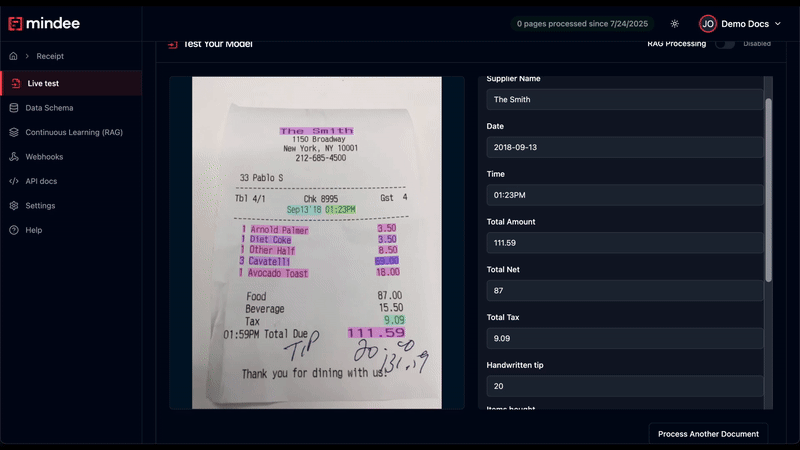

# Live Test



## Overview

The **Live Test** page lets you _interactively test your model_ on real documents and visually inspect the extraction results in one click.

It’s the perfect place to debug, validate, and refine your model’s behavior before moving to production.

## Key Features

* **Side-by-side comparison**: Visually compare the raw document on the left with structured extraction results on the right, ideal for validating model behavior at a glance.
* **Interactive document viewer**: Hover, click, and inspect highlighted fields directly on the image. Tooltips show extracted values and metadata in context.
* **View raw JSON output**: Toggle to display the full JSON response returned by the API, allowing developers to inspect field names, values, coordinates, confidence scores, and nested structures.
* **Instant visual feedback**: See where each field was extracted directly on the document.
* **RAG Toggle**: If your have added documents into your RAG database, you can simulate how RAG would influence the output.

## Accessing the Live Test Page

The Live Test is available for all Mindee models.

From your home page on the Mindee platform, simply click on any model.

The first page you see will be the Live Test page.

You can always go back to the Live Test page by clicking on the left-hand model menu.

## How it Works

1. Upload or drag a document (PDF or image) directly into the interface.
2. Mindee runs the current version of your model on the document.
3. The extracted fields appear on the right-hand side, alongside the image preview.
4. Each field is:
   * **highlighted on the document** with color-coded overlays, showcasing the polygon features that can be enabled in the data schema option.
   * listed in the right panel with values, field names, and optionally confidence scores if the [automation-confidence-score.md](optional-features/automation-confidence-score.md "mention") feature is enabled.

<figure><figcaption>
By clicking the polygon, you can also see its corresponding field on the right side.
</figcaption></figure>
