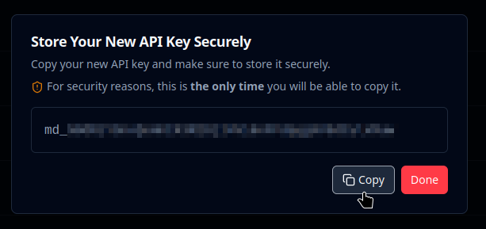

# API Keys

## Overview


**Do not expose your API keys in any location that is open to the public.**

Anyone with the key will be able to make API requests linked to your organization.


An organization can have multiple API keys.

Each API Key grants access to all models within the organization.

API Keys, unlike tokens, have an unlimited lifetime and must be manually revoked.

## Key Creation

Before using the API, you'll need to create an API key.

To create an API Key on the Mindee Platform:

1. On the left-hand menu, click "<i class="fa-gear">:gear:</i> Settings", then go to the "API Keys" tab.\
   <a href="https://app.mindee.com/settings?tab=api-keys" class="button primary">Go to API Keys</a>
2. Click on the **Create API Key** button
3. Give a name to your key.\
   You'll typically want to name by environment, i.e. `dev`, `staging`, `prod`, \&c
4. Click **Create API**, you key is now ready for use.
5. Your new key will be displayed, click **Copy**, and store your key somewhere safe.\
   


As a security precaution, you will **not** be able to retrieve the key after creation!


## Key Revocation/Deletion

You can revoke a key at any time by deleting it.

Once a key is deleted, it can never be recovered.

Any calls to Mindee made using a deleted key will result in a HTTP 401 error code.

To delete a key on the Mindee Platform:

1. On the left-hand menu, click "<i class="fa-gear">:gear:</i> Settings", then go to the "API Keys" tab.\
   <a href="https://app.mindee.com/settings?tab=api-keys" class="button primary">Go to API Keys</a>
2. Next to each key is a **Delete** button, click it.
3. Click **Delete** in the confirmation dialog, your key is now revoked.

## Using an API Key

When creating an API key, make sure to copy the key and store it somewhere safe.

You can then to use it when making API calls.

Take a look at the [#initialize-the-mindee-client](client-libraries-sdk/configure-the-client.md#initialize-the-mindee-client "mention") section for more details.
