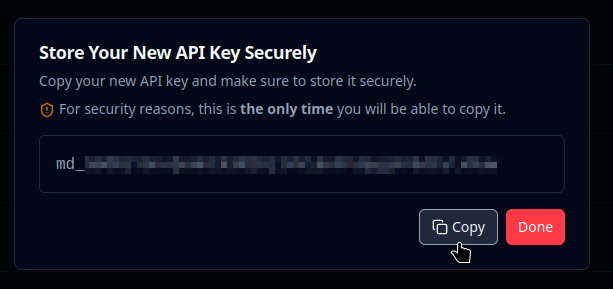

# Manage API Keys

## Overview

API keys are secure credentials that allow your applications to interact with Mindee’s services. Each key is associated with your organization and usage is tracked accordingly.


**Do not expose your API keys in any location that is open to the public.**

Anyone with the key will be able to make API requests impersonating your organization.


An organization can have multiple API keys.

Each API Key grants access to all models within the organization.

API Keys, unlike tokens, have an unlimited lifetime and must be manually revoked.

## Access the API Key Dashboard 

1. Log in to [https://app.mindee.com](https://app.mindee.com)
2. On the left-hand menu, click "<i class="fa-gear">:gear:</i> **Settings**"
3. In the Settings page, click on the "**API Keys**" tab.

Or, click this button:\
<a href="https://app.mindee.com/settings?tab=api-keys" class="button primary">Go to API Keys</a>

## Key Creation

Before using the API, you'll need to create an API key.

To create an API Key on the Mindee Platform:

1. Access the [API Keys Dashboard](api-keys.md#h_5e7b745363)
2. Click on the "**+ Create API Key**" button
3. Give a name to your key.\
   You'll typically want to name by environment, i.e. `dev`, `staging`, `prod`, \&c
4. Click "**Create API Key**", your key is now created.
5. Your new key will be displayed, click **Copy**, and store your key somewhere safe.\
   


As a security precaution, you will **not** be able to retrieve the key after creation!


Your key is now ready for use.

## Key Revocation/Deletion

You can revoke a key at any time by deleting it.

Once a key is deleted, it can never be recovered.

Any calls to Mindee made using a deleted key will be rejected, resulting in a HTTP 401 error code.

To delete a key on the Mindee Platform:

1. Access the [API Keys Dashboard](api-keys.md#h_5e7b745363)
2. &#x20;You will see a list of all your current API Keys.
3. Next to each key is a "<i class="fa-trash-can">:trash-can:</i> **Delete**" button, click it.
4. A confirmation dialog will appear.
5. Click "**Delete**" in the confirmation dialog, your key is now deleted.

## Using an API Key

When creating an API key, **make sure to copy the key and store it somewhere safe**.

You can then to use it when making API calls.

Take a look at the [#initialize-the-mindee-client](client-libraries-sdk/configure-the-client.md#initialize-the-mindee-client "mention") section for more details.

## Best practices for API keys

1. Keeping your API keys in your environment variables is a good and safe practice.
2. Don’t store your API key directly in your code or in your front-end.
3. Avoid exposing your secret API keys on GitHub, on the client-side, or in any other location that is open to the public.
4. If you have any doubt your API Key leaked, delete it and replace it as soon as possible.
5.  Periodically change your API keys

    To do so:

    1. Create a new API key;
    2. Update your application to use the new API key;
    3. Delete the old API key.
