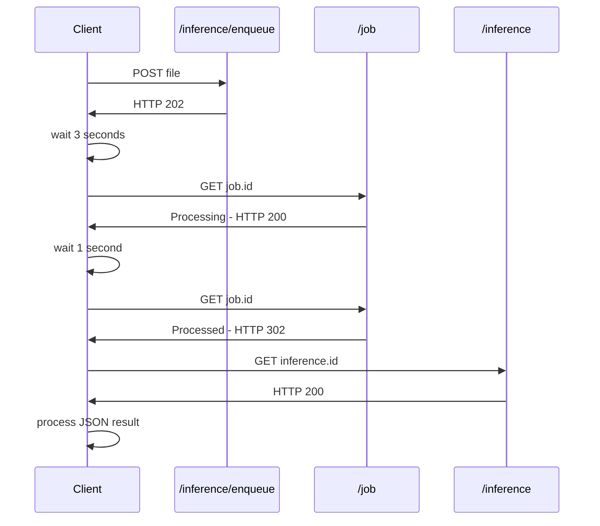
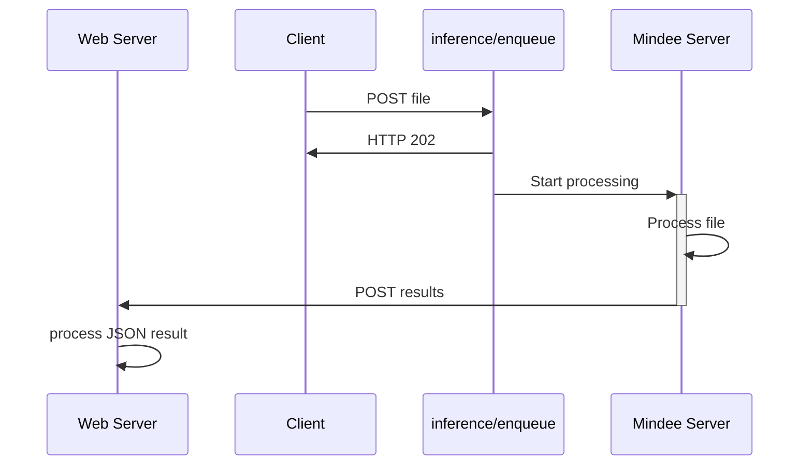

# API Overview

## API Keys

Before using the API, you'll need to create an API key.

An organization can have multiple API keys.

Each API Key grants access to all models within the organization.

To create an API Key on the Mindee Platform:

1. Go to [https://app.mindee.com/](https://app.mindee.com/)
2. On the left-hand menu, click [**API Keys**](https://app.mindee.com/api-keys)
3. Click on the **Create API Key** button
4. Give a name to your key.\
   You'll typically want to name by environment, i.e. dev, staging, prod.
5. Click **OK**, you key is now ready for use.


**Do not expose your API keys in any location that is open to the public.**

Anyone with the key will be able to make requests linked to your organization.


## Usage in Web Applications

We **do not recommend** using the Mindee API directly in an application running in the final user's web browser.

Users will trivially be able to intercept the API Key used for the Mindee requests, and impersonate your account.

Our official guideline is to always pass your user requests through a server which you control.\
Not only will this prevent leakage of sensitive data, it will allow you to much more easily diagnose any issues your users may have.

## Accepted File Types

#### PDF Files

All PDF types can be processed, either single page or multiple pages.

Each PDF page can be a combination of text and image elements.

#### Image Files

Most common image types can be processed.

Specifically, we accept the following image types:

* `jpeg`
* `png` (only non-animated)
* `webp`
* `heic`
* `heif`
* `tiff` single page or multiple pages

## REST API Integration

There are two different ways of setting up your integration with the Mindee API.

### Polling

The polling flow is simpler to set up, and allows a quick integration.

It's perfect for testing Mindee on a local machine, and is suitable for lightweight production use.

This flow can also be integrated with various 3rd party tooling such as MS Power Automate or Zapier.

If you're not sure on what to use, choose this flow.

### Webhook

Webhooks have the fastest response times and are the most flexible.

It is the recommended method for production use, especially for heavy usage.\
\
Webhooks are particularly adapted to processing many files within a short period of time.\
For example multiple batches of invoices at the end of the month.

You'll need to have your own webserver and a URL that Mindee can send `POST` requests to.

The URL must be public-facing and secured (TLS).

