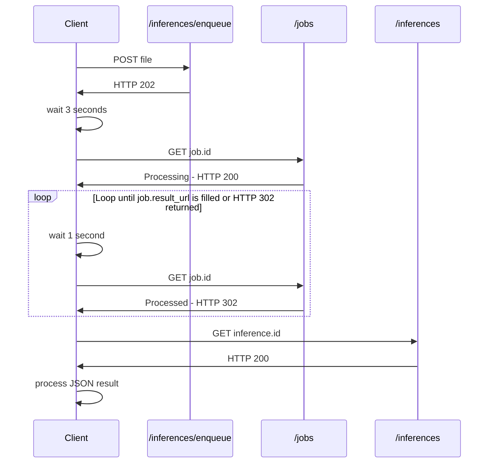
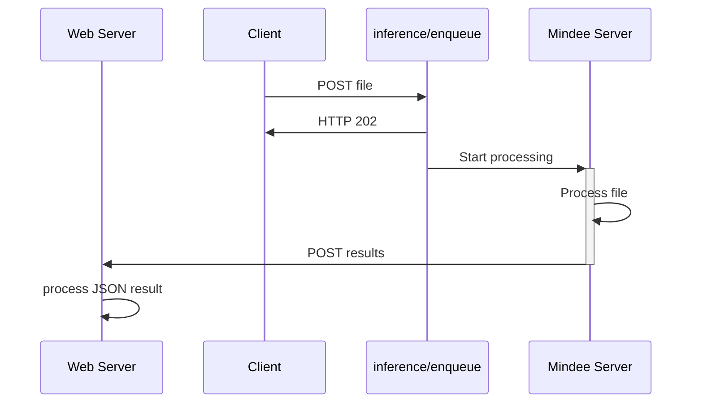

# API Overview

## API Keys


**Do not expose your API keys in any location that is open to the public.**

Anyone with the key will be able to make API requests linked to your organization.


An organization can have multiple API keys.

Each API Key grants access to all models within the organization.

Keys have an unlimited lifetime and must be manually revoked by deleting them.

### Key Creation

Before using the API, you'll need to create an API key.

To create an API Key on the Mindee Platform:

1. On the left-hand menu, click [**API Keys**](https://app.mindee.com/api-keys)
2. Click on the **Create API Key** button
3. Give a name to your key.\
   You'll typically want to name by environment, i.e. dev, staging, prod.
4. Click **Create API**, you key is now ready for use.

### Key Revocation/Deletion

You can revoke a key at any time by deleting it.

Once a key is deleted, it can never be recovered.

Any calls to Mindee made using a deleted key will result in a HTTP 401 error code.

To delete a key on the Mindee Platform:

1. On the left-hand menu, click [**API Keys**](https://app.mindee.com/api-keys)
2. Next to each key is a **Delete** button, click it.
3. Click **Delete** in the confirmation dialog, your key is now revoked.

## Usage in Web Applications

We **do not recommend** using the Mindee API directly in an application running in the final user's web browser.

Users will trivially be able to intercept the API Key used for the Mindee requests, and impersonate your account.

Our official guideline is to always pass your user requests through a server which you control.\
Not only will this prevent leakage of sensitive data, it will allow you to much more easily diagnose any issues your users may have.

## Accepted File Types

### PDF Files

All PDF types can be processed, either single page or multiple pages.

Each PDF page can be a combination of text and image elements.

### Image Files

Most common image types can be processed.

Specifically, we accept the following image types:

* `jpeg`
* `png` (only non-animated)
* `webp`
* `heic`
* `heif`
* `tiff` single page or multiple pages

### Guidelines For Uploading Images

Following these guidelines will ensure you get the most accurate results as quickly as possible.

#### **Reduce very large images**

For faster upload and processing, downscale large images by resizing them.

For example modern smartphones can take images of 24 megapixels or more, in most cases this is completely useless, a waste of bandwidth and processing time.

For the vast majority of image files, 3-5 megapixels is enough. Just make sure the smallest text is legible.

#### **Do not upscale or enhance**

Never upscale a low-resolution image, adding extra pixels only adds to processing time without an increase in accuracy.\
It is best to avoid very low-resolution images, if possible.

#### **Keep the aspect ratio**

Never change the original aspect ratio. Doing so will create distortions and degrade the performance of the OCR.

## REST API Integration

There are two different ways of setting up your integration with the Mindee API.

### Polling

The polling flow is simpler to set up, and allows a quick integration.

It's perfect for testing Mindee on a local machine, and is suitable for lightweight production use.

This flow can also be integrated with various 3rd party tooling such as MS Power Automate or Zapier.

If you're not sure on what to use, choose this flow.

### Webhook

Webhooks have the fastest response times and are the most flexible.

It is the recommended method for production use, especially for heavy usage.\
\
Webhooks are particularly adapted to processing many files within a short period of time.\
For example multiple batches of invoices at the end of the month.

You'll need to have your own webserver and a URL that Mindee can send `POST` requests to.

The URL must be public-facing and secured (TLS).

