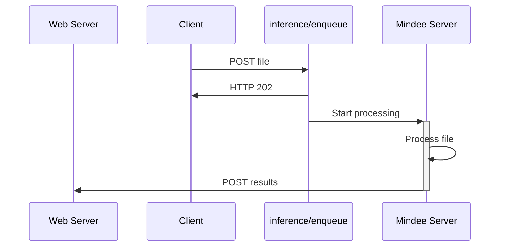

# API Overview

## API Keys

Before using the API, you'll need to create an API key.

Each organization can have multiple API keys.

To create an API Key on the Mindee Platform:

1. Go to [https://app.mindee.com/](https://app.mindee.com/)
2. On the left-hand menu, click [**API Keys**](https://app.mindee.com/api-keys)
3. Click on the **Create API Key** button
4. Give a name to your key.\
   You'll typically want to name by environment, i.e. dev, staging, prod.

## REST API Integration

There are two different ways of setting up your integration with the Mindee API.

### Accepted File Types

Images and PDFs can be processed.

### Polling

The polling flow is simpler to set up, and allows a quick integration.

It's perfect for testing Mindee on a local machine, and is suitable for lightweight production use.

This flow can also be integrated with various 3rd party tooling such as MS Power Automate or Zapier.

If you're not sure on what to use, choose this flow.

### Webhook

Webhooks have the fastest response times and are the most flexible.

It is the recommended method for production use, especially for heavy usage.\
\
Webhooks are particularly adapted to processing many files within a short period of time.\
For example multiple batches of invoices at the end of the month.

You'll need to have your own webserver and a URL that Mindee can send `POST` requests to.

The URL must be public-facing and secured (TLS).

