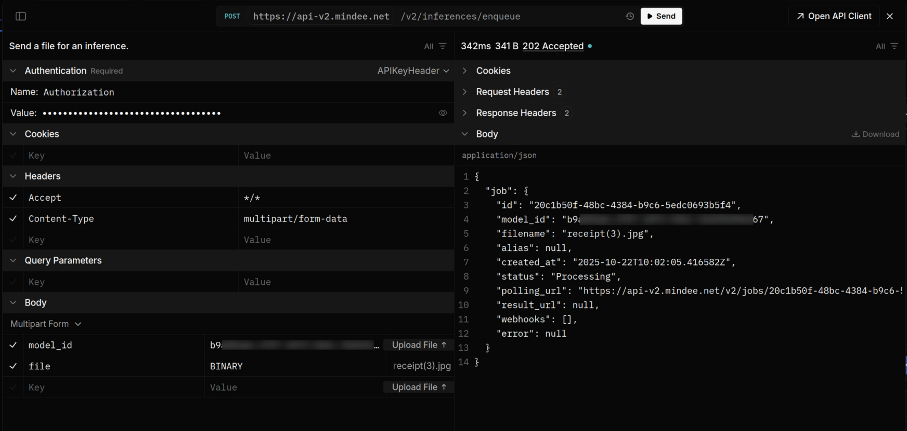

# Manual Integration


**We do not recommend manually integrating**, and cannot guarantee full support in this case.



**Recommended integrations:**

* [client-libraries-sdk](client-libraries-sdk/ "mention")
* [no-code-integrations](no-code-integrations/ "mention")

Also take a look at the [api-overview.md](api-overview.md "mention") if you are setting up your integration for the first time.


If you would like to download the OpenAPI specification directly, it is available here:\
[https://api-v2.mindee.net/openapi.json](https://api-v2.mindee.net/openapi.json)


[OpenAPI mindee-api](https://api-v2.mindee.net/openapi.json)


Here is a working example of the built-in test client:

<figure><figcaption></figcaption></figure>


[OpenAPI mindee-api](https://api-v2.mindee.net/openapi.json)



[OpenAPI mindee-api](https://api-v2.mindee.net/openapi.json)



[OpenAPI mindee-api](https://api-v2.mindee.net/openapi.json)

