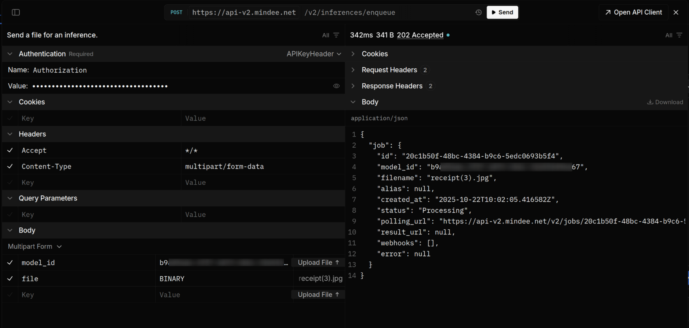

# Manual Integration




If you would like to download the OpenAPI specification directly, it is available here:\
[https://api-v2.mindee.net/openapi.json](https://api-v2.mindee.net/openapi.json)


The bare Mindee HTTP API is RESTful, and returns data in a JSON format.

API routes and schemas are organized according to the type of model:

* [extraction-models.md](extraction-models.md "mention")
* [split-models.md](split-models.md "mention")
* [crop-models.md](crop-models.md "mention")
* [classification-models.md](classification-models.md "mention")
* [ocr-models.md](ocr-models.md "mention")

For each section you can find the complete documentation of all routes, including cURL samples and a built-in testing tool.

Here is a working example of the built-in test client for an Extraction Model. Other models are similar.

<figure><figcaption></figcaption></figure>
