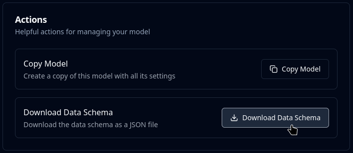

# Configure the Client



## Requirements

Before proceeding you'll need to have one of the [official Mindee client libraries](./) installed.

You'll also need to use one of your [#api-keys](../api-overview.md#api-keys "mention") and one or several [Models](../../extraction-models/models-overview.md) configured.

## Overview

Before sending any files to the Mindee servers for processing, you'll need to initialize your client and set inference options.

These settings will determine how your files are sent, including any extra options, and how you want to process the result.

## Initialize the Mindee Client

This should be the first step in your code. It will determine which organization is used to make the calls.

You should reuse the same client instance for all calls of the same organization.

The client instance is thread-safe where applicable.



First import the needed classes:

```python
from mindee import (
    ClientV2,
    InferenceParameters,
    InferenceResponse,
    PathInput,  # for loading files from disk
)
```

For the API key, you can pass it directly to the client.\
This is useful for quick testing.

```python
api_key = "MY_API_KEY"

mindee_client = ClientV2(api_key)
```

Instead of passing the key directly, you can also set the following environment variable:

`MINDEE_V2_API_KEY`

This is recommended for production use.\
In this way there is no need to pass the `api_key` when initializing the client.

```python
mindee_client = ClientV2()
```



First import the needed classes. We recommend using ES Modules.

```typescript
import * as mindee from "mindee";
// If you're on CommonJS:
// const mindee = require("mindee");
```

For the API key, you can pass it directly to the client.\
This is useful for quick testing.

```typescript
const apiKey = "MY_API_KEY";

const mindeeClient = new mindee.Client({ apiKey: apiKey });
```

Instead of passing the key directly, you can also set the following environment variable:

`MINDEE_V2_API_KEY`

This is recommended for production use.\
In this way there is no need to pass the `apiKey` argument when initializing the client.

```typescript
const mindeeClient = new mindee.Client();
```

#### Advanced Usage

internally, [undici](https://undici.nodejs.org/) is used for making HTTP calls, and when the client is initialized `getGlobalDispatcher` is called.

**This is perfectly fine for the vast majority of cases:**\
If you set a custom Agent as the global dispatcher, Mindee will use it.

In the rare case where you need a specific dispatcher for Mindee, you can set it as follows:

```javascript
import { Agent, interceptors } from "undici",

// Init the custom Dispatcher
// REPLACE THE LINE BELOW WITH YOUR CODE - this example will NOT work!
const myAgent = new Agent();

const mindeeClient = new mindee.Client({
  // Don't set if using an environment variable
  apiKey: apiKey,

  // Activates verbose logging - disable in production!
  debug: true,

  // Pass the custom dispatcher to the Mindee client
  dispatcher: myAgent,
});
```



First import the needed classes:

```php
use Mindee\ClientV2;
use Mindee\Input\InferenceParameters;
use Mindee\Error\MindeeException;
```

For the API key, you can pass it directly to the client.\
This is useful for quick testing.

```php
$apiKey = "MY_API_KEY";

$mindeeClient = new ClientV2($apiKey);
```

Instead of passing the key directly, you can also set the following environment variable:

`MINDEE_V2_API_KEY`

This is recommended for production use.\
In this way there is no need to pass the `$apiKey` when initializing the client.

```php
$mindeeClient = new ClientV2($apiKey);
```



First import the Mindee package:

```ruby
require 'mindee'
```

For the API key, you can pass it directly to the client.\
This is useful for quick testing.

```ruby
api_key = 'MY_API_KEY'
mindee_client = Mindee::ClientV2.new(api_key: api_key)
```

Instead of passing the key directly, you can also set the following environment variable:

`MINDEE_V2_API_KEY`

This is recommended for production use.\
In this way there is no need to pass the `api_key` when initializing the client.

```ruby
mindee_client = Mindee::ClientV2.new()
```



First import the needed classes:

```java
import com.mindee.MindeeClientV2;
import com.mindee.InferenceParameters;
```

For the API key, you can pass it directly to the client.\
This is useful for quick testing.

```java
String apiKey = "MY_API_KEY";

MindeeClientV2 mindeeClient = new MindeeClientV2(apiKey);
```

Instead of passing the key directly, you can also set the following environment variable:

`MINDEE_V2_API_KEY`

This is recommended for production use.\
In this way there is no need to pass the `apiKey` argument when initializing the client.

```java
MindeeClientV2 mindeeClient = new MindeeClientV2();
```



First add the required namespaces.

```csharp
using Mindee;
using Mindee.Input;
```

For the API key, you can pass it directly to the client.\
This is useful for quick testing.

```csharp
string apiKey = "MY_API_KEY";

MindeeClientV2 mindeeClient = new MindeeClientV2(apiKey);
```

Instead of passing the key directly, you can also set the following environment variable:

`MindeeV2__ApiKey`

This is recommended for production use.\
In this way there is no need to pass the `apiKey` argument when initializing the client.

```csharp
MindeeClientV2 mindeeClient = new MindeeClientV2();
```



## Set Product Parameters

Product parameters control:

* which model to use
* server-side processing options
* how the results will be returned to you

### Use an Alias

You can set an alias for linking the sent file to your own system.

For example, you could use an internal PO number, or your database ID.

Aliases are not unique in our database, you can use the same alias multiple times.



Only the `model_id` is required.

```python
inference_params = InferenceParameters(
    # ID of the model, required.
    model_id="MY_MODEL_ID",
    
    # Use an alias to link the file to your own DB.
    # If empty, no alias will be used.
    alias="MY_ALIAS",
    
    # ... any other options ...
)
```



Only the `modelId` is required.

```typescript
const productParams = {
  // ID of the model, required.
  modelId: "MY_MODEL_ID",
  
  // Use an alias to link the file to your own DB.
  // If empty, no alias will be used.
  alias: "MY_ALIAS",
  
  // ... any other options ...
};
```



Only the `modelId` is required.

```php
$inferenceParams = new InferenceParameters(
    // ID of the model, required.
    "MY_MODEL_ID",

    // Use an alias to link the file to your own DB.
    // If empty, no alias will be used.
    alias: "MY_ALIAS",
    
    // ... any other options ...
);
```



Only the `model_id` is required.

```ruby
inference_params = Mindee::Input::InferenceParameters.new(
    # ID of the model, required.
    'MY_MODEL_ID',
    
    # Use an alias to link the file to your own DB.
    # If empty, no alias will be used.
    file_alias: 'MY_ALIAS',
    
    # ... any other options ...
)
```



Only the `modelId` is required.

```java
InferenceParameters params = InferenceParameters
    // ID of the model, required.
    .builder("MY_MODEL_ID")
    
    // Use an alias to link the file to your own DB.
    // If empty, no alias will be used.
    .alias("MY_ALIAS")
    
    // ... any other options ...

    // complete the builder
    .build();
```



Only the `modelId` is required.

```csharp
var inferenceParams = new InferenceParameters(
    // ID of the model, required.
    modelId: "MY_MODEL_ID"

    // Use an alias to link the file to your own DB.
    // If empty, no alias will be used.
    , alias: "MY_ALIAS"
    
    // ... any other options ...
);
```



### Optional Features Configuration

Enable or disable [optional-features](../../extraction-models/optional-features/ "mention").


Enabling a feature not in your plan will result in a Payment Required error (HTTP 402).

Check the [#feature-comparison](../../account-management/plans.md#feature-comparison "mention") section for more information.


The default activation states for Optional Features are set on the platform.\
Any values set here will override the defaults.

Leave empty or null to use the default platform values.

For example: if the Polygon feature is enabled on the platform, and polygon is explicitly set to `false` in the parameters ⇒ the Polygon feature will **not** be enabled for the API call.



Only the `model_id` is required.

```python
inference_params = InferenceParameters(
    # ID of the model, required.
    model_id="MY_MODEL_ID",

    # Optional Features: set to `True` or `False` to override defaults

    # Enhance extraction accuracy with Retrieval-Augmented Generation.
    rag=None,
    # Extract the full text content from the document as strings.
    raw_text=None,
    # Calculate bounding box polygons for all fields.
    polygon=None,
    # Boost the precision and accuracy of all extractions.
    # Calculate confidence scores for all fields.
    confidence=None,
    
    # ... any other options ...
)
```



Only the `modelId` is required.

```typescript
const productParams = {
  // ID of the model, required.
  modelId: "MY_MODEL_ID",

  // Optional Features: set to `true` or `false` to override defaults

  // Enhance extraction accuracy with Retrieval-Augmented Generation.
  rag: undefined,
  // Extract the full text content from the document as strings.
  rawText: undefined,
  // Calculate bounding box polygons for all fields.
  polygon: undefined,
  // Boost the precision and accuracy of all extractions.
  // Calculate confidence scores for all fields.
  confidence: undefined,
  
  // ... any other options ...
};
```



Only the `modelId` is required.

```php
$inferenceParams = new InferenceParameters(
    // ID of the model, required.
    "MY_MODEL_ID",

    // Optional Features: set to `true` or `false` to override defaults

    // Enhance extraction accuracy with Retrieval-Augmented Generation.
    rag: null,
    // Extract the full text content from the document as strings.
    rawText: null,
    // Calculate bounding box polygons for all fields.
    polygon: null,
    // Boost the precision and accuracy of all extractions.
    // Calculate confidence scores for all fields.
    confidence: null,
    
    // ... any other options ...
);
```



Only the `model_id` is required.

```ruby
inference_params = Mindee::Input::InferenceParameters.new(
    # ID of the model, required.
    'MY_MODEL_ID',

    # Options: set to `true` or `false` to override defaults

    # Enhance extraction accuracy with Retrieval-Augmented Generation.
    rag: nil,
    # Extract the full text content from the document as strings.
    raw_text: nil,
    # Calculate bounding box polygons for all fields.
    polygon: nil,
    # Boost the precision and accuracy of all extractions.
    # Calculate confidence scores for all fields.
    confidence: nil,
    
    # ... any other options ...
)
```



Only the `modelId` is required.

```java
InferenceParameters params = InferenceParameters
    // ID of the model, required.
    .builder("MY_MODEL_ID")

    // Optional Features: set to `true` or `false` to override defaults

    // Enhance extraction accuracy with Retrieval-Augmented Generation.
    .rag(null)
    // Extract the full text content from the document as strings.
    .rawText(null)
    // Calculate bounding box polygons for all fields.
    .polygon(null)
    // Boost the precision and accuracy of all extractions.
    // Calculate confidence scores for all fields.
    .confidence(null)
    
    // ... any other options ...

    // complete the builder
    .build();
```



Only the `modelId` is required.

```csharp
var inferenceParams = new InferenceParameters(
    // ID of the model, required.
    modelId: "MY_MODEL_ID"

    // Optional Features: set to `true` or `false` to override defaults

    // Enhance extraction accuracy with Retrieval-Augmented Generation.
    , rag: null
    // Extract the full text content from the document as strings.
    , rawText: null
    // Calculate bounding box polygons for all fields.
    , polygon: null
    // Boost the precision and accuracy of all extractions.
    // Calculate confidence scores for all fields.
    , confidence: null
    
    // ... any other options ...
);
```



### Dynamic Model Options

These options allow changing how the model performs an inference on a per-call basis.

As such they can only be used via API.

#### Text Context

Give additional guidelines to the model to help it better process a specific document.

This is a free-form text format.

#### Data Schema

In the rare cases when Text Context and/or RAG is not enough.

Directly modify the Data Schema: add, remove, or change fields.

To download the JSON string appropriate for your model:

1. Go to your model's page
2. On the left-hand menu, click on "General Settings"
3. Scroll down to the "Actions" section
4.  Click on the "Download Data Schema" button:<br>

    <figure><figcaption></figcaption></figure>

#### Code Sample

The Data Schema can be passed as a JSON string or by instantiating the appropriate classes.

If passed as a JSON string, it will be validated in the client before being sent to the server.



Only the `model_id` is required.

```python
inference_params = InferenceParameters(
    # ID of the model, required.
    model_id="MY_MODEL_ID",
    
    # Text Context
    text_context="this is an invoice.",
    
    # Data Schema
    data_schema="{ ... JSON DATA ... }",
    
    # ... any other options ...
)
```



Only the `modelId` is required.

```typescript
const productParams = {
  // ID of the model, required.
  modelId: "MY_MODEL_ID",
  
  // Text Context
  textContext: "this is an invoice.",
    
  // Data Schema
  dataSchema: "{ ... JSON DATA ... }",
  
  // ... any other options ...
};
```



Only the `modelId` is required.

```php
$inferenceParams = new InferenceParameters(
    // ID of the model, required.
    "MY_MODEL_ID",

    // Text Context
    textContext: "this is an invoice.",

    // Data Schema
    dataSchema: "{ ... JSON DATA ... }",

    // ... any other options ...
);
```



Only the `model_id` is required.

```ruby
inference_params = Mindee::Input::InferenceParameters.new(
    # ID of the model, required.
    'MY_MODEL_ID',
    
    # Text Context
    text_context: "this is an invoice.",
    
    # Data Schema
    data_schema: "{ ... JSON DATA ... }",
    
    # ... any other options ...
)
```



Only the `modelId` is required.

```java
InferenceParameters params = InferenceParameters
    // ID of the model, required.
    .builder("MY_MODEL_ID")
    
    // Text Context
    .textContext("this is an invoice.")
    
    // Data Schema
    .dataSchema("{ ... JSON DATA ... }")
    
    // ... any other options ...

    // complete the builder
    .build();
```



Only the `modelId` is required.

```csharp
var inferenceParams = new InferenceParameters(
    // ID of the model, required.
    modelId: "MY_MODEL_ID"
    
    // Text Context
    , textContext: "this is an invoice."
    
    // Data Schema
    , dataSchema: "{ ... JSON DATA ... }"
    
    // ... any other options ...
);
```



## Next Steps

Now that everything is ready to, it's time to send your files to the Mindee servers.

If you're sending a local file, head on over to the [load-and-adjust-a-file.md](load-and-adjust-a-file.md "mention") section for details on the next step.

If you're sending an URL, head on over to the [send-a-file-or-url.md](send-a-file-or-url.md "mention") section.
