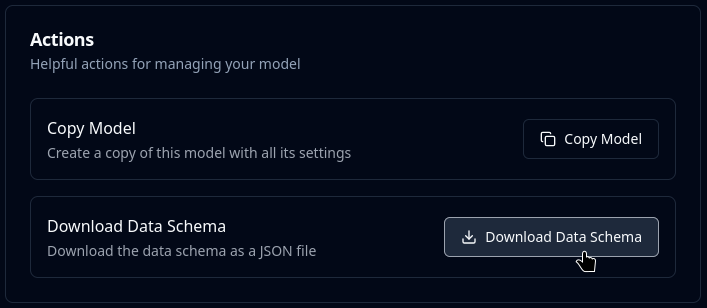

# Configure the Product

## Generic Product Parameters

Parameters that apply to all Mindee products (Extraction, Split, Crop, etc).

Product parameters control:

* which model to use
* server-side processing options

### Use an Alias

The optional `alias` field lets you attach your own identifier to a request as a free-form string.

For example, an internal document ID, reference number, or database key.

It is echoed back unchanged in both the job and result responses, making it straightforward to correlate API results with your own records.

Aliases are not unique in Mindee, you can use the same alias value multiple times.



```python
inference_params = InferenceParameters(
    # ID of the model, required.
    model_id="MY_MODEL_ID",
    
    # Use an alias to link the file to your own DB.
    # If set, it will be included in the job and result responses.
    alias="internal-doc-id-123",
    
    # ... any other options ...
)
```



```typescript
const productParams = {
  // ID of the model, required.
  modelId: "MY_MODEL_ID",
  
  // Use an alias to link the file to your own DB.
  // If set, it will be included in the job and result responses.
  alias: "internal-doc-id-123",
  
  // ... any other options ...
};
```



```php
$inferenceParams = new InferenceParameters(
    // ID of the model, required.
    "MY_MODEL_ID",

    // Use an alias to link the file to your own DB.
    // If set, it will be included in the job and result responses.
    alias: "internal-doc-id-123",
    
    // ... any other options ...
);
```



```ruby
inference_params = {
    # ID of the model, required.
    model_id: 'MY_MODEL_ID',
    
    # Use an alias to link the file to your own DB.
    # If set, it will be included in the job and result responses.
    file_alias: 'internal-doc-id-123',
    
    # ... any other options ...
}
```



```java
InferenceParameters params = InferenceParameters
    // ID of the model, required.
    .builder("MY_MODEL_ID")
    
    // Use an alias to link the file to your own DB.
    // If set, it will be included in the job and result responses.
    .alias("internal-doc-id-123")
    
    // ... any other options ...

    // complete the builder
    .build();
```



```csharp
var inferenceParams = new InferenceParameters(
    // ID of the model, required.
    modelId: "MY_MODEL_ID"

    // Use an alias to link the file to your own DB.
    // If set, it will be included in the job and result responses.
    , alias: "internal-doc-id-123"
    
    // ... any other options ...
);
```



## Extraction Product Parameters

### Optional Features Configuration

Enable or disable [optional-features](../../extraction-models/optional-features/ "mention").


Enabling a feature not in your plan will result in a Payment Required error (HTTP 402).

Check the [#feature-comparison](../../account-management/plans.md#feature-comparison "mention") section for more information.


The default activation states for Optional Features are set on the platform.\
Any values set here will override the defaults.

Leave empty or null to use the default platform values.

For example: if the Polygon feature is enabled on the platform, and polygon is explicitly set to `false` in the parameters ⇒ the Polygon feature will **not** be enabled for the API call.



Only the `model_id` is required.

```python
inference_params = InferenceParameters(
    # ID of the model, required.
    model_id="MY_MODEL_ID",

    # Optional Features: set to `True` or `False` to override defaults

    # Enhance extraction accuracy with Retrieval-Augmented Generation.
    rag=None,
    # Extract the full text content from the document as strings.
    raw_text=None,
    # Calculate bounding box polygons for all fields.
    polygon=None,
    # Boost the precision and accuracy of all extractions.
    # Calculate confidence scores for all fields.
    confidence=None,
    
    # ... any other options ...
)
```



Only the `modelId` is required.

```typescript
const productParams = {
  // ID of the model, required.
  modelId: "MY_MODEL_ID",

  // Optional Features: set to `true` or `false` to override defaults

  // Enhance extraction accuracy with Retrieval-Augmented Generation.
  rag: undefined,
  // Extract the full text content from the document as strings.
  rawText: undefined,
  // Calculate bounding box polygons for all fields.
  polygon: undefined,
  // Boost the precision and accuracy of all extractions.
  // Calculate confidence scores for all fields.
  confidence: undefined,
  
  // ... any other options ...
};
```



Only the `modelId` is required.

```php
$inferenceParams = new InferenceParameters(
    // ID of the model, required.
    "MY_MODEL_ID",

    // Optional Features: set to `true` or `false` to override defaults

    // Enhance extraction accuracy with Retrieval-Augmented Generation.
    rag: null,
    // Extract the full text content from the document as strings.
    rawText: null,
    // Calculate bounding box polygons for all fields.
    polygon: null,
    // Boost the precision and accuracy of all extractions.
    // Calculate confidence scores for all fields.
    confidence: null,
    
    // ... any other options ...
);
```



Only the `model_id` is required.

```ruby
inference_params = {
    # ID of the model, required.
    model_id: 'MY_MODEL_ID',

    # Options: set to `true` or `false` to override defaults

    # Enhance extraction accuracy with Retrieval-Augmented Generation.
    rag: nil,
    # Extract the full text content from the document as strings.
    raw_text: nil,
    # Calculate bounding box polygons for all fields.
    polygon: nil,
    # Boost the precision and accuracy of all extractions.
    # Calculate confidence scores for all fields.
    confidence: nil,
    
    # ... any other options ...
}
```



Only the `modelId` is required.

```java
InferenceParameters params = InferenceParameters
    // ID of the model, required.
    .builder("MY_MODEL_ID")

    // Optional Features: set to `true` or `false` to override defaults

    // Enhance extraction accuracy with Retrieval-Augmented Generation.
    .rag(null)
    // Extract the full text content from the document as strings.
    .rawText(null)
    // Calculate bounding box polygons for all fields.
    .polygon(null)
    // Boost the precision and accuracy of all extractions.
    // Calculate confidence scores for all fields.
    .confidence(null)
    
    // ... any other options ...

    // complete the builder
    .build();
```



Only the `modelId` is required.

```csharp
var inferenceParams = new InferenceParameters(
    // ID of the model, required.
    modelId: "MY_MODEL_ID"

    // Optional Features: set to `true` or `false` to override defaults

    // Enhance extraction accuracy with Retrieval-Augmented Generation.
    , rag: null
    // Extract the full text content from the document as strings.
    , rawText: null
    // Calculate bounding box polygons for all fields.
    , polygon: null
    // Boost the precision and accuracy of all extractions.
    // Calculate confidence scores for all fields.
    , confidence: null
    
    // ... any other options ...
);
```



### Dynamic Model Options

These options allow changing how the model performs an inference on a per-call basis.

As such they can **only** be used via API.


These advanced features are not generally meant for improving model accuracy.

Instead, make sure the Data Schema has been [properly optimized](../../extraction-models/data-schema.md#performance-optimization).&#x20;


#### Text Context

Give additional guidelines to the model to help it better process a specific document.

This is a free-form text format.

#### Data Schema

Allows changing the Data Schema on a per-call basis: directly modify the Data Schema: add, remove, or change fields.

The typical use case is when the data needing to be extracted change based on internal business logic.

To download the JSON string appropriate for your model:

1. Go to your model's page
2. On the left-hand menu, click on "General Settings"
3. Scroll down to the "Actions" section
4.  Click on the "Download Data Schema" button:<br>

    <figure><figcaption></figcaption></figure>

#### Code Sample

The Data Schema can be passed as a JSON string or by instantiating the appropriate classes.

If passed as a JSON string, it will be validated in the client before being sent to the server.



Only the `model_id` is required.

```python
inference_params = InferenceParameters(
    # ID of the model, required.
    model_id="MY_MODEL_ID",
    
    # Text Context
    text_context="this is an invoice.",
    
    # Data Schema
    data_schema="{ ... JSON DATA ... }",
    
    # ... any other options ...
)
```



Only the `modelId` is required.

```typescript
const productParams = {
  // ID of the model, required.
  modelId: "MY_MODEL_ID",
  
  // Text Context
  textContext: "this is an invoice.",
    
  // Data Schema
  dataSchema: "{ ... JSON DATA ... }",
  
  // ... any other options ...
};
```



Only the `modelId` is required.

```php
$inferenceParams = new InferenceParameters(
    // ID of the model, required.
    "MY_MODEL_ID",

    // Text Context
    textContext: "this is an invoice.",

    // Data Schema
    dataSchema: "{ ... JSON DATA ... }",

    // ... any other options ...
);
```



Only the `model_id` is required.

```ruby
inference_params = {
    # ID of the model, required.
    model_id: 'MY_MODEL_ID',
    
    # Text Context
    text_context: "this is an invoice.",
    
    # Data Schema
    data_schema: "{ ... JSON DATA ... }",
    
    # ... any other options ...
}
```



Only the `modelId` is required.

```java
InferenceParameters params = InferenceParameters
    // ID of the model, required.
    .builder("MY_MODEL_ID")
    
    // Text Context
    .textContext("this is an invoice.")
    
    // Data Schema
    .dataSchema("{ ... JSON DATA ... }")
    
    // ... any other options ...

    // complete the builder
    .build();
```



Only the `modelId` is required.

```csharp
var inferenceParams = new InferenceParameters(
    // ID of the model, required.
    modelId: "MY_MODEL_ID"
    
    // Text Context
    , textContext: "this is an invoice."
    
    // Data Schema
    , dataSchema: "{ ... JSON DATA ... }"
    
    // ... any other options ...
);
```


