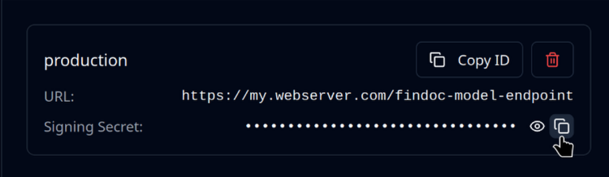

# Response Processing



## Requirements

You'll need to have already sent a file or URL as described in the [send-a-file-or-url.md](send-a-file-or-url.md "mention") section.

## Overview

Depending on how you've sent the file, there are two ways of obtaining the result.

If you've sent via polling (or polling and webhook) you'll get the response directly in your method call.

If you've sent only via webhook, you'll receive the response on your Web server.

Here we'll go over how you can best process the results.

## Load From Webhook

If you're using the webhook pattern, you'll need to use the payload sent to your Web server.

Reading the callback data will vary greatly depending on your HTTP server.\
This is therefore beyond the scope of this example.

Regardless of how you access the JSON payload sent by the Mindee servers, loading this data is done by using a LocalResponse class.

Once it is loaded you can access the data in exactly the same way as a polling response.

To verify the HMAC signature, you'll need the Signing Secret from the webhook:

<figure><figcaption></figcaption></figure>



Assuming you're able to get the raw HTTP request via the variable `request` .

```python
from mindee import LocalResponse, InferenceResponse

# Load the JSON string sent by the Mindee webhook POST callback.
local_response = LocalResponse(request.body())

# You can also load the json from a local path.
# local_response = LocalResponse("path/to/my/file.ext")

# Optionally: verify the HMAC signature
# You'll need to get the "X-Signature" custom HTTP header.
hmac_signature = request.headers.get("X-Signature")
is_valid = local_response.is_valid_hmac_signature(
    "obviously-fake-secret-key", hmac_signature
)
if not is_valid:
    raise Error("Bad HMAC signature! Is someone trying to do evil?")

# Deserialize the response into objects
response = local_response.deserialize_response(InferenceResponse)
```



Assuming you're able to get the raw HTTP request via the variable `request` .

```javascript
async handleMindeeResponse(data, hmacSignature) {
  const localResponse = new mindee.LocalResponse(data);
  await localResponse.init();

  const isValid = localResponse.isValidHmacSignature(
      "obviously-fake-secret-key", hmacSignature
    );
  if (!isValid) {
    throw Error("Bad HMAC signature! Is someone trying to do evil?");
  }
  const response = await localResponse.deserializeResponse(
    mindee.InferenceResponse
  );
}

// Load the JSON string sent by the Mindee webhook POST callback.
// Will vary depending on your implementation.
async handleMindeePost(request, response) {
  let body = "";
  request.on("data", function (data) {
    body += data;
  });
  req.on("end", function () {
    // Optionally: verify the HMAC signature
    // You'll need to get the "X-Signature" custom HTTP header.
    const hmacSignature = request.headers.get("X-Signature");
    
    // validate using the entire body of the response with the signature header
    await handleMindeeResponse(body, hmacSignature);
  });
}
```



Assuming you're able to get the raw HTTP request via the variable `request` .

```ruby
require 'mindee'

# Load the JSON string sent by the Mindee webhook POST callback.
local_response = Mindee::Input::LocalResponse.new(request.body.to_s)

# You can also use a File object as the input.
# FILE_PATH = File.join('path', 'to', 'file.json').freeze
# local_response = Mindee::Input::LocalResponse.new(FILE_PATH);

# Optional: verify the HMAC signature.
unless local_response.valid_hmac_signature?(my_secret_key, 'dummy signature')
  raise "Invalid HMAC signature!"
end

# Deserialize the response:
response = local_response.deserialize_response(
  Mindee::V2::Product::Extraction::ExtractionResponse
)

# Print a summary of the parsed data in RST format
puts response
```



Assuming you're able to get the raw HTTP request via the variable `$requestBody` .

```php
<?php
  use Mindee\Input\LocalResponse;
  use Mindee\Error\MindeeException;
  use Mindee\Parsing\V2\InferenceResponse;

  // Load the JSON string sent by the Mindee webhook POST callback.
  $localResponse = new LocalResponse($requestBody);
  
  // Or load from a file path:
  // $localResponse = new LocalResponse($filePath);

  // Optional: verify the HMAC signature.
  if (!$localResponse->isValidHmacSignature($mySecretKey, 'dummy signature')){
    throw new MindeeException("Invalid HMAC signature!");
  }
  
  // Deserialize the response:
  $response = $localResponse->deserializeResponse(InferenceResponse::class);

  // Print a summary of the parsed data in RST format
  echo $response->inference;
```



Assuming you have a Web server instance `myHttpServer` .

```java

// Load the JSON string sent by the Mindee webhook POST callback.
String jsonData = myHttpServer.getPostBodyAsString();
LocalResponse localResponse = new LocalResponse(jsonData);

// Verify the HMAC signature.
// You'll need to get the "X-Signature" custom HTTP header.
String hmacSignature = myHttpServer.getHeader("X-Signature");
boolean isValid = localResponse.isValidHmacSignature(
    "obviously-fake-secret-key", hmacSignature
);
if (!isValid) {
    throw new Exception("Bad HMAC signature! Is someone trying to do evil?");
}

// You can also use a File object as the input.
//LocalResponse localResponse = new LocalResponse(
//    new File("/path/to/file.json"));

// Deserialize the response into objects
InferenceResponse response = localResponse.deserializeResponse(
    InferenceResponse.class
);

// Print a summary of the parsed data
System.out.println(response.getInference().toString());
```



Assuming you're able to get the raw HTTP request via the variable `request` .

```csharp
using Mindee.V2.Parsing;
using Mindee.V2.Product.Extraction;

public void HandleMindeeCallback(HttpRequest request)
{
    LocalResponse localResponse;

    using (var reader = new StreamReader(request.Body))
    {
        localResponse = new LocalResponse(reader.ReadToEnd());
    }
    
    // Verify the HMAC signature.
    // You'll need to get the "X-Signature" custom HTTP header.
    string hmacSignature = request.Headers.get("X-Signature");
    bool isValid = localResponse.IsValidHmacSignature(
         "obviously-fake-secret-key", hmacSignature);
    if (!isValid)
        throw new Exception("Bad HMAC signature! Is someone trying to do evil?");

    // Deserialize the response into objects
    var response = localResponse.DeserializeResponse<ExtractionResponse>();
    
    // Print a summary of the parsed data
    System.Console.WriteLine(response.Inference);
}
```



## The Response Object

This is the base object of the response.

It doesn't do much on its own except allow you to access the [Inference object](process-the-response.md#the-inference-object).

The response object can be used to retrieve the raw response from the server, as a JSON string:



```python
from mindee import InferenceResponse

def handle_response(response: InferenceResponse):
    response_json = response.raw_http
```



```javascript
handleResponse(response) {
  const responseJson = response.getRawHttp();
}
```



```php
use Mindee\Parsing\V2\InferenceResponse;

public function handleResponse(InferenceResponse $response)
{
    $responseJson = $response->getRawHttp();
}
```



```ruby
require 'mindee'

def handle_response(response)
  response_json = response.raw_http
end
```



```java
import com.mindee.parsing.v2.InferenceResponse;

public void handleResponse(InferenceResponse response) {
    String responseJSON = response.getRawResponse();
}
```



```csharp
using Mindee.V2.Product.Extraction;

public void HandleResponse(ExtractionResponse response)
{
    string responseJson = response.RawResponse;
}
```



## The Inference Object

This is the top-level object in the response.

It contains the following attributes:

* `id` UUID of the inference
* `model` Model used for the inference
* `file` Metadata concerning the file used for the inference
* `result` Result of inference processing, the most important portion of the response.
  * Fields: For handling the extracted fields, see the [extraction-result-fields.md](../../extraction-models/sdk-integration/extraction-result-fields.md "mention") section.
  * Raw Text: For using the extracted text, see the [#raw-text](process-the-response.md#raw-text "mention") section.

## File Metadata

You can access various metadata concerning the file sent for processing.

Using the Response object from either the polling response or a webhook payload:



```python
from mindee import InferenceResponse
from mindee.parsing.v2 import InferenceFile

def handle_response(response: InferenceResponse):
    inference_file: InferenceFile = response.inference.file

    # various attributes are available, such as:
    filename: str = inference_file.name
    page_count: int = file.page_count
    mime_type: str = file.mine_type
```



```javascript
handleResponse(response) {
  const file = response.inference.file;

  // various attributes are available, such as:
  const filename = file.name;
  const pageCount = file.pageCount;
  const mimeType = file.mimeType;
}
```



```php
use Mindee\Parsing\V2\InferenceResponse;

public function handleResponse(InferenceResponse $response)
{
    $file = $response->inference->file;

    // various attributes are available, such as:
    $filename = $file->name;
    $pageCount = $file->pageCount;
    $mimeType = $file->mimeType;
}
```



```ruby
require 'mindee'

def handle_response(response)
  file = response.inference.file

  # various attributes are available, such as:
  filename = inference_file.name
  page_count = file.page_count
  mime_type = file.mime_type
end
```



```java
import com.mindee.parsing.v2.InferenceFile;
import com.mindee.parsing.v2.InferenceResponse;

public void handleResponse(InferenceResponse response) {
    InferenceFile file = response.inference.getFile();

    // various attributes are available, such as:
    String filename = file.getName();
    int pageCount = file.getPageCount();
    String mimeType = file.getMimeType();
}
```



```csharp
using Mindee.V2.Product.Extraction;

public void HandleResponse(ExtractionResponse response)
{
    var file = response.Inference.File;

    // various attributes are available, such as:
    string filename = file.Name;
    int pageCount = file.PageCount;
    string mimeType = file.MimeType;
}
```


