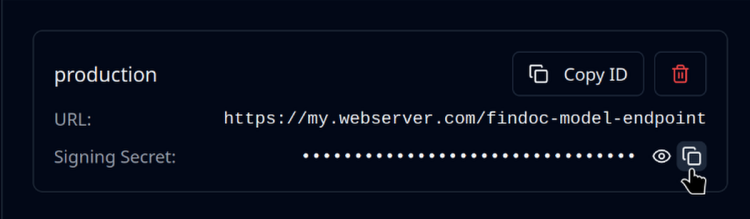

# Process the Result



## Requirements

You'll need to have already sent a file or URL as described in the [send-a-file-or-url.md](send-a-file-or-url.md "mention") section.

## Overview

Depending on how you've sent the file, there are two ways of obtaining the result.

If you've sent via polling (or polling and webhook) you'll get the response directly in your method call.

If you've sent only via webhook, you'll receive the response on your Web server.

Here we'll go over how you can best process the results.

## Load From Webhook

If you're using the webhook pattern, you'll need to use the payload sent to your Web server.

Reading the callback data will vary greatly depending on your HTTP server.\
This is therefore beyond the scope of this example.

Regardless of how you access the JSON payload sent by the Mindee servers, loading this data is done by using a LocalResponse class.

Once it is loaded you can access the data in exactly the same way as a polling response.

To verify the HMAC signature, you'll need the Signing Secret from the webhook:

<figure><figcaption></figcaption></figure>



Assuming you're able to get the raw HTTP request via the variable `request` .

```python
from mindee import LocalResponse, InferenceResponse

# Load the JSON string sent by the Mindee webhook POST callback.
local_response = LocalResponse(request.body())

# You can also load the json from a local path.
# local_response = LocalResponse("path/to/my/file.ext")

# Optionally: verify the HMAC signature
# You'll need to get the "X-Signature" custom HTTP header.
hmac_signature = request.headers.get("X-Signature")
is_valid = local_response.is_valid_hmac_signature(
    "obviously-fake-secret-key", hmac_signature
)
if not is_valid:
    raise Error("Bad HMAC signature! Is someone trying to do evil?")

# Deserialize the response into objects
response = local_response.deserialize_response(InferenceResponse)
```



Assuming you're able to get the raw HTTP request via the variable `request` .

```typescript
function handleMindeeResponse(data, hmacSignature) {
  const localResponse = new mindee.LocalResponse(data);
  const isValid = localResponse.isValidHmacSignature(
      "obviously-fake-secret-key", hmacSignature
    );
  if (!isValid) {
    throw Error("Bad HMAC signature! Is someone trying to do evil?");
  }
  const response = localResponse.deserializeResponse(
    mindee.InferenceResponse
  );
}

// Getting the data could look something like this.
// Will vary depending on your implementation.
function handleMindeePost(request, response) {
  let body = "";
  request.on("data", function (data) {
    body += data;
  });
  req.on("end", function () {
    // Optionally: verify the HMAC signature
    // You'll need to get the "X-Signature" custom HTTP header.
    const hmacSignature = request.headers.get("X-Signature");
    
    handleMindeeResponse(data, hmacSignature);
  });
}
```



Assuming you have a Web server instance `myHttpServer` .

```java

// Load the JSON string sent by the Mindee webhook POST callback.
String jsonData = myHttpServer.getPostBodyAsString();
LocalResponse localResponse = new LocalResponse(jsonData);

// Verify the HMAC signature.
// You'll need to get the "X-Signature" custom HTTP header.
String hmacSignature = myHttpServer.getHeader("X-Signature");
boolean isValid = localResponse.isValidHmacSignature(
    "obviously-fake-secret-key", hmacSignature
);
if (!isValid) {
    throw new Exception("Bad HMAC signature! Is someone trying to do evil?");
}

// You can also use a File object as the input.
//LocalResponse localResponse = new LocalResponse(
//    new File("/path/to/file.json"));

// Deserialize the response into objects
InferenceResponse response = localResponse.deserializeResponse(
    InferenceResponse.class
);

// Print a summary of the parsed data
System.out.println(response.getDocument().toString());
```



## Accessing Fields

Fields are completely dynamic and depend on your model's [data-schema.md](../../models/data-schema.md "mention").

In the client library, you'll have access to the various fields as a mapping type (Python's `dict`, Java's `HashMap`, etc).

Accessing a field is done via its name in the Data Schema.

Each field will be one of the following types:

* A single value, `SimpleField` class.
* Multiple values (an object), `ObjectField` class.
* A list or array of fields, `ListField` class.

## Optional Field Attributes

These field attributes are only filled when their respective features are activated.

The attributes are always present even when not activated.

### confidence

The confidence level of the extracted value.

Only filled if the automation feature is activated.\
See the [automation-confidence-score.md](../../models/automation-confidence-score.md "mention") section for more details.



Using the `response` deserialized object from either the polling response or a webhook payload.

```csharp
using Mindee.Parsing.V2.Field;

InferenceFields fields = response.Inference.Result.Fields;

// nullable enum since presence depends on feature activation
FieldConfidence? confidence = fields["my_simple_field"].SimpleField.Confidence;
```



### locations

A list of the field's locations on the document.

Only filled if the polygons feature is activated.

It's possible for a single field to have multiple locations, for example when an invoice item spans two pages.

Each location has a page index and a polygon.



Using the `response` deserialized object from either the polling response or a webhook payload.

```csharp
using Mindee.Parsing.V2.Field;
using Mindee.Geometry;

InferenceFields fields = response.Inference.Result.Fields;

List<FieldLocation> locations = fields["my_simple_field"].SimpleField.Locations;

// there are geometry functions available in the Polygon class
Polygon polygon = locations.First().Polygon;
Point center = polygon.GetCentroid();
```



## Single-Value Field - SimpleField

Basic field type having the `value` attribute.

In addition, the `Simplefield` class has [#confidence](process-the-result.md#confidence "mention") and [#locations](process-the-result.md#locations "mention") attributes.

### value

The extracted data value.\
Possible types: string, number (integer or floating-point), boolean.\
All types can be null.

On the platform, you can specify date and classification types.\
These are returned as strings.

For statically-typed languages (C#, Java), the client library will always return a nullable `double` for number values.



Using the `response` deserialized object from either the polling response or a webhook payload.

```csharp
using Mindee.Parsing.V2.Field;

InferenceFields fields = response.Inference.Result.Fields;

SimpleField mySimpleField = fields["my_simple_field"].SimpleField;
var fieldValue = mySimpleField.Value;
```

The `Value` attribute is a `dynamic` type under the hood.

You can explicitly declare the type, this is recommended for clarity.\
You'll need to look at your Data Schema to declare the correct type.

```csharp
using Mindee.Parsing.V2.Field;

InferenceFields fields = response.Inference.Result.Fields;

// texts, dates, classifications ...
string stringFieldValue = fields["string_field"].SimpleField.Value;

// a JSON float will be a Double
Double floatFieldValue = fields["float_field"].SimpleField.Value;

// even if the API always returns an integer, the type will be Double
Double intFieldValue = fields["int_field"].SimpleField.Value;

// booleans
Boolean boolFieldValue = fields["bool_field"].SimpleField.Value;
```

If the wrong type is declared, an exception will be raised, something like this:

```
RuntimeBinderException : Cannot implicitly convert type 'string' to 'double'
```



## Multiple-Value Field - ObjectField

Each field can _theoretically_ be of any type (single, multi, list).\
**In practice:** we limit to a single value, meaning no recursive objects nor lists.

Each sub-field will be a [#single-value-field-simplefield](process-the-result.md#single-value-field-simplefield "mention").

In addition, the `ObjectField` class has [#confidence](process-the-result.md#confidence "mention") and [#locations](process-the-result.md#locations "mention") attributes.

## List of Fields - ListField

Each item in the list can _theoretically_ be of any type (single, multi, list).\
**In practice:** we limit items to be either single or multi field, meaning no lists of lists.

Each field in the list will be one of:

* [#single-value-field-simplefield](process-the-result.md#single-value-field-simplefield "mention")
* [#multiple-value-field-objectfield](process-the-result.md#multiple-value-field-objectfield "mention")

There will **not** be a mix of both types in the same list.

In addition, the `ListField` class has a [#confidence](process-the-result.md#confidence "mention") attribute.
