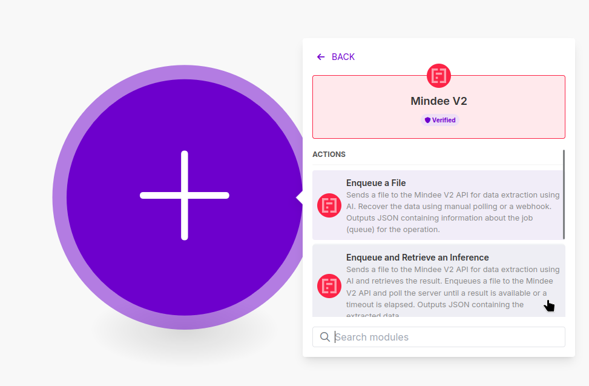

# make.com Scenarios


Only use the official **Mindee V2** app.

Community apps only work for Mindee V1.


## Use Mindee in a Scenario

You can use the Mindee app in any make.com scenario.

When adding a module, search for "mindee" and select **Mindee V2**:

<figure><figcaption>
Adding Mindee V2 to a scenario. Make sure to use the "verified" version.
</figcaption></figure>

The Mindee V2 app has several possible modules, choose "Enqueue and Retrieve an Inference".

You may need to click on "Show more" to access it.

The other modules are for specific requirements and are not recommended for general usage.

<figure><figcaption></figcaption></figure>

Once you have the "Enqueue and Retrieve an Inference" module in your scenario, you'll need to connect it to your [API key](../api-keys.md).

For this, click on the "Create a connection" button:

<figure><figcaption></figcaption></figure>
