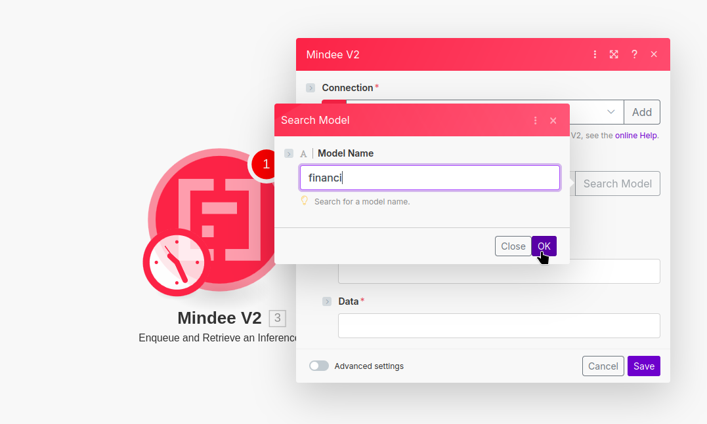

# make.com Scenarios


Only use the verified **Mindee V2** app.

Community apps only work for Mindee V1.


## Add Mindee to a Make.com Scenario

You can use the Mindee app in any make.com scenario.

When adding a module, search for "mindee" and select **Mindee V2** verified:

<figure><figcaption></figcaption></figure>

Next, choose the "Extract Document Data" action:

<figure><figcaption></figcaption></figure>

Once you have the "Extract Document Data" module in your scenario, you'll need to connect it to one of your [api-keys.md](../api-keys.md "mention").

For this, click on the "Create a connection" button:

<figure><figcaption></figcaption></figure>

In the Create a connection dialog box, fill in the following information:

* A name for your connection, it should be in the format: `MindeeV2-` + your API key's name
* your [Mindee V2 API key](../api-keys.md#key-creation)

Finish by clicking "Save".

<figure><figcaption></figcaption></figure>

Now you can specify which model to use. For this click on "Search Model":

<figure><figcaption></figcaption></figure>

In the dialog window, you'll be able to enter a search string.

Enter in the name of the model you want to use and click "OK".

<figure><figcaption></figcaption></figure>

If there is only one match to your search term, the model ID will be added.

If there are several matches to your search, choose the correct one from the list:

<figure><figcaption></figcaption></figure>


**That's it, you're done!** The Mindee V2 module is now ready to accept connections.


Click on "Save".


**Do not fill in the "File" information in the Mindee V2 module.**

This is done automatically by connecting an appropriate module.

