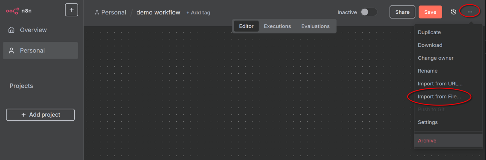
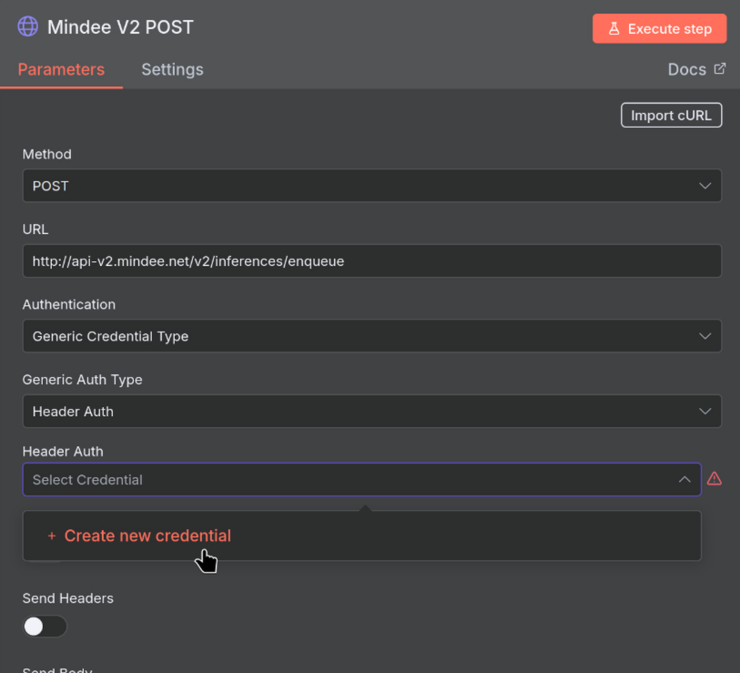
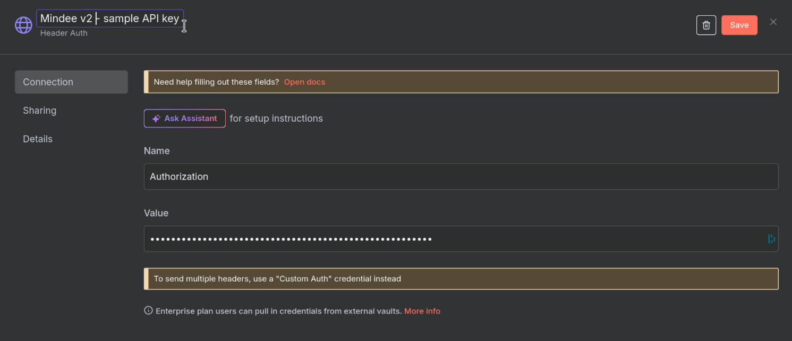
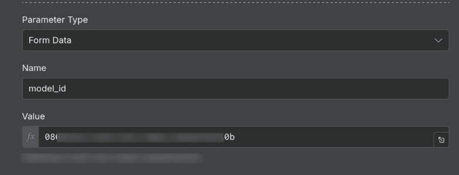

# n8n Workflows


**The existing "Mindee" node in n8n is for the legacy v1 version, it will not work for v2.**

Use the instructions below to integrate n8n.

We are working on updating the Mindee n8n node.


## Use a Sample Workflow

Use our provided sample workflow and use it as base for creating your own workflow.

You can also import into an existing workflow, the new nodes will simply be added.

### Import the Sample Workflow

First step is to download our sample workflow file below:



Next, import it into a new or existing n8n workflow:

<figure><figcaption></figcaption></figure>

Once the file is imported the nodes and steps will show up.

### Configure the Authentication

Open the "Mindee V2 Post" node by double-clicking it, and create a Header Auth Credential:

<figure><figcaption></figcaption></figure>

When creating your Credential, first choose one of your [api-keys.md](../api-keys.md "mention").

Then, set the following values in the Credential dialog box:

| Name                       | Value                               |
| -------------------------- | ----------------------------------- |
| Credential Name (top left) | `Mindee v2 -` + your API key's name |
| Header Name                | `Authorization`                     |
| Header Value               | Your API key's value                |

It should look something like this when done:

<figure><figcaption></figcaption></figure>

Next, make sure the following nodes are all using the Credential just created:

* "Mindee V2 GET Job"&#x20;
* "Mindee V2 GET Inference"

It should be done automatically, but please open each node and make sure!

When all nodes are using the same Credential, authentication is set up correctly.

### Configure the Model ID

First copy your model's ID from the Mindee platform.

Open the "Mindee V2 Post" node, and scroll to the "Body Parameters" section.

Set the value of the "model\_id" parameter to your model's ID.

It should look something like this:

<figure><figcaption></figcaption></figure>

The workflow is now configured to use the specified model.

### Test the Workflow

We've included a "HTTP Request" node that will download a sample invoice file from our Github repository.

Simply click the "Execute workflow" button and follow along as the various nodes/steps are executed.

In this way make sure the workflow is able to arrive at the "Result" step. The actual contents of the result don't matter, since the sample file is there only for testing the API connection. The sample file is not meant for testing your model.

Once you're able to get a result, change the "HTTP Request" node to something actually useful to you.

Some examples:

* use an IMAP trigger to process email attachments
* use an FTP trigger to process files on an FTP server
