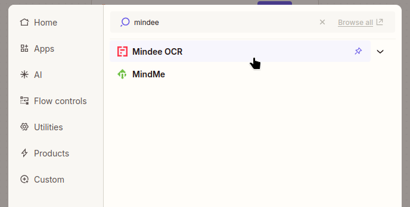
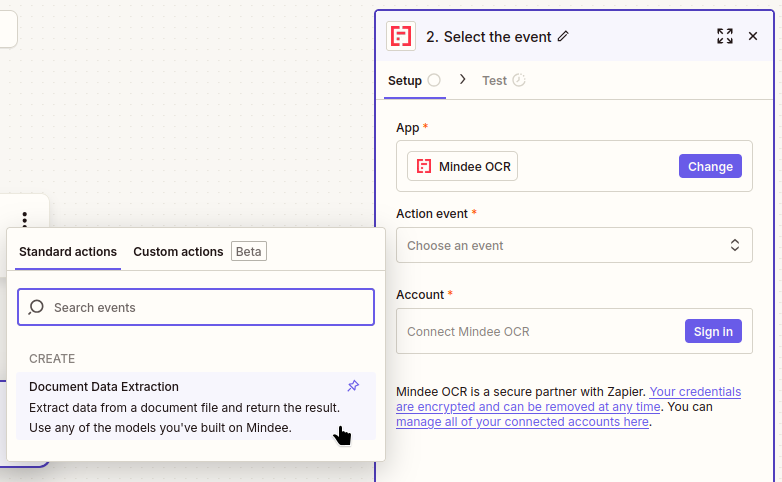
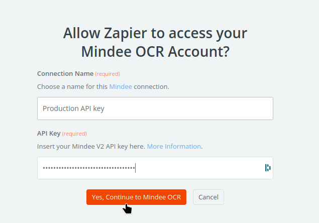
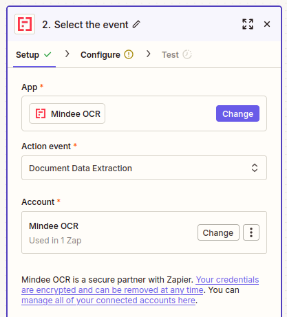
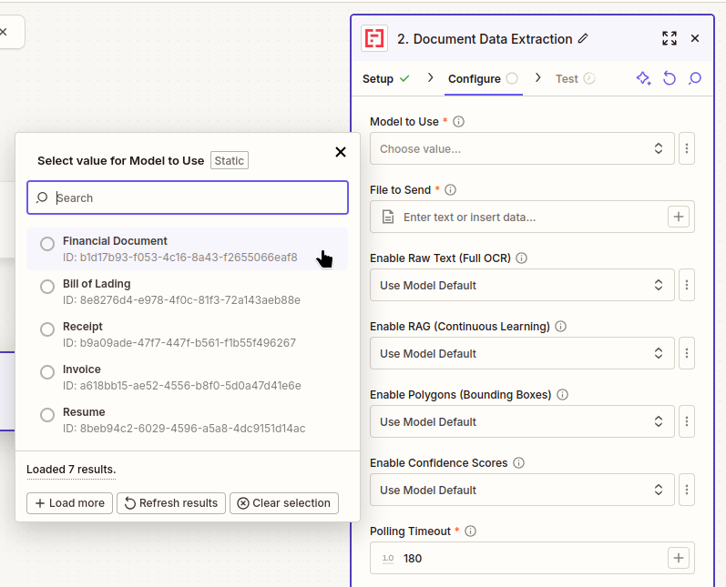
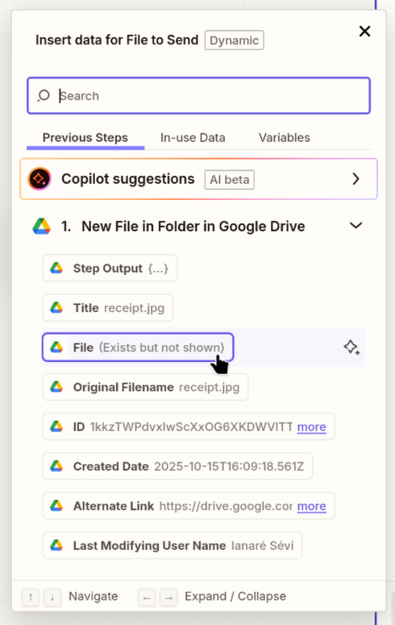
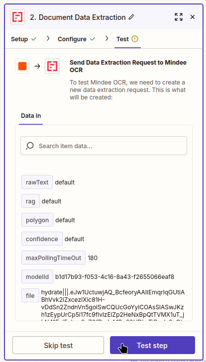
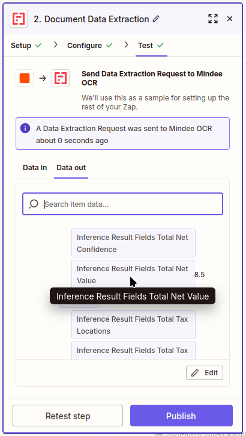

# Zapier Zaps

## Add Mindee Data Extraction to a Zap 

You can use the Mindee App as a step in any zap.

### Setup App

When adding a step, search for "_mindee_" and select **Mindee OCR**:

<figure><figcaption></figcaption></figure>

You should now have the Mindee App installed.

Next choose the "Action event" by clicking on "**Document Data Extraction**":

<figure><figcaption></figcaption></figure>

Next, you'll need to connect the App to one of your [api-keys.md](../api-keys.md "mention").

If you already have a Mindee connection configured in Zapier, you'll have the option to "select" a connection in the "Account" section.

Otherwise, click on the "Sign in" button in the "Account" section.

Then, in the connection dialog box, fill in the following information:

* A name for your connection, for example your API key's name
* your [Mindee V2 API key](../api-keys.md#key-creation)

Finish by clicking on "Yes, Continue to Mindee OCR":

<figure><figcaption></figcaption></figure>


You'll be able to re-use this connection in other Zaps that include the Mindee App.


Your Step should now look something like this:

<figure><figcaption></figcaption></figure>

Next, to configure the action, click on "Continue" at the bottom of the screen.

### Configure the Data Extraction Action

First, click on "Model to Use", you'll then be given a list of models available in your organization\
Click the one that you want to use:

<figure><figcaption></figcaption></figure>

For the "File to Send", you'll need to connect to a valid file input.

Normally it will be a field called "**File (Exists but not shown)**".\
As an example, here is what it looks like when connecting to a Drive folder:

<figure><figcaption></figcaption></figure>

You can also set various options:



* "Polling Timeout" - The maximum number of seconds to attempt retrieving results, before stopping with an error. Increase this value if you are sending documents with many pages and are consistently getting timeout errors.

Next, to test the step, click on "Continue" at the bottom of the screen.

### Test the Step

If everything in the previous steps was configured correctly, you should now have something that looks like this:

<figure><figcaption></figcaption></figure>

After clicking on "Test step", the file will be sent to Mindee for processing.

When complete, it should look like this:

<figure><figcaption></figcaption></figure>

Congrats, everything works!

After the data is extracted, it will be usable by any Step in your Zap.
