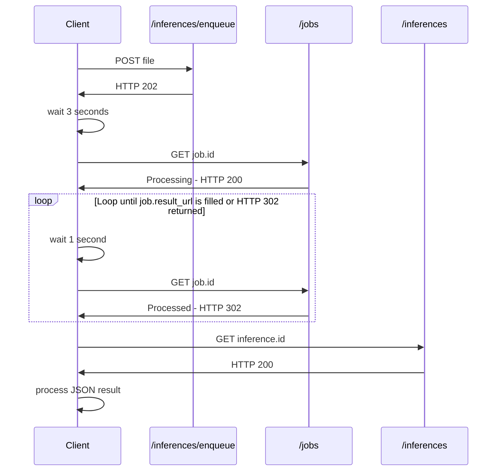

# Polling for Results

## Overview

The polling flow is simpler to set up, and allows a quick integration.

It's perfect for testing Mindee on a local machine, and is suitable for lightweight production use.

This flow can also be integrated with various 3rd party tooling such as MS Power Automate or Zapier.

If you're not sure on what to use, choose this flow.

### Sequence Diagram

## Specifying on File Upload

We highly recommend using one of our [client-libraries-sdk](client-libraries-sdk/ "mention").

Instructions for your language of choice are detailed in the [#send-with-polling](client-libraries-sdk/send-a-file-or-url.md#send-with-polling "mention") section.

Otherwise take a look at the [#post-v2-inferences-enqueue](api-reference.md#post-v2-inferences-enqueue "mention") specification.
