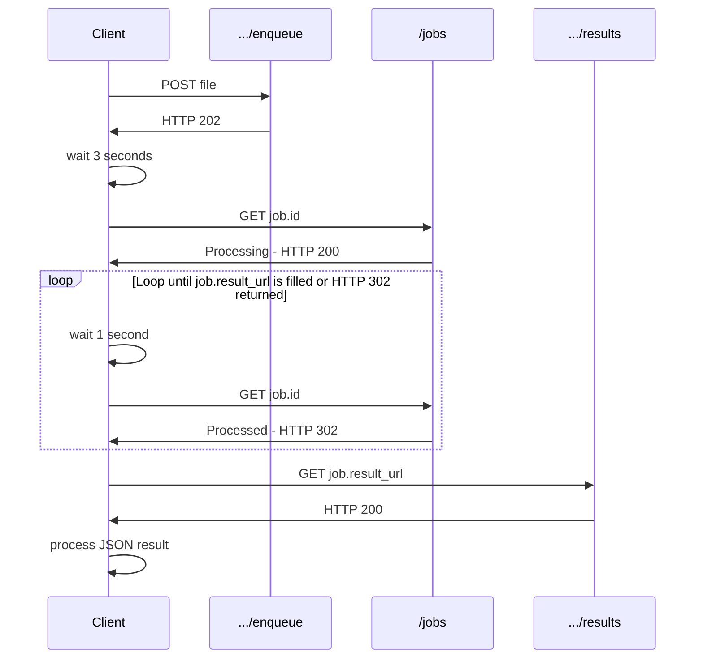

# Using Polling

## Overview

The polling flow is simpler to set up, and allows a quick integration.

It's perfect for testing Mindee on a local machine, and is suitable for lightweight production use.

This flow can also be integrated with various 3rd party tooling such as MS Power Automate.

If you're not sure on what to use, choose this flow.

### Sequence Diagram

```mermaid
sequenceDiagram
    participant client as Client
    participant enqueue as .../enqueue
    participant job as /jobs
    participant results as .../results
    client->>enqueue: POST file
    enqueue->>client: HTTP 202
    client->>client: wait 3 seconds
    client->>job: GET job.id
    job->>client: Processing - HTTP 200
    loop Loop until job.result_url is filled or HTTP 302 returned
      client->>client: wait 1 second
      client->>job: GET job.id
      job->>client: Processed - HTTP 302
    end
    client->>results: GET job.result_url
    results->>client: HTTP 200
    client->>client: process JSON result
```

## Send Files Using Polling

When using the SDKs, this asynchronous polling process is completely transparent to you.

You only need to call a single synchronous method and await its return.

For more information, consult: [#polling-configuration](client-libraries-sdk/send-a-file-or-url.md#polling-configuration "mention")

#### Stopping the Process

Once a request has been sent, it is not possible to stop or cancel the processing.
