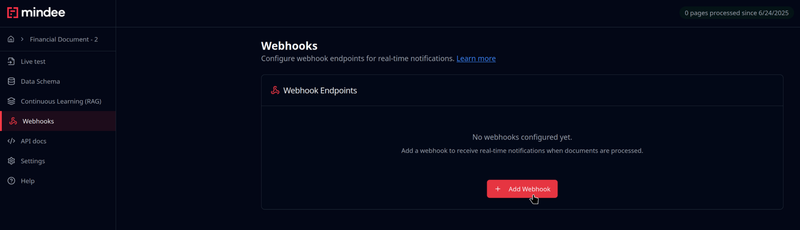

# Webhook Results


This page assumes you have experience setting up a Web server in your language of choice.


## Overview

Webhooks allow Mindee to post an inference result directly to your Web server.

They have the fastest response times and are the most flexible.

It is the recommended method for production use, especially for heavy usage.\
\
Webhooks are particularly adapted to processing many files within a short period of time.\
For example multiple batches of invoices at the end of the month.

You'll need to have your own webserver and a URL that Mindee can send `POST` requests to.

The URL must be public-facing and secured (TLS).

### Sequence Diagram

## Platform Set Up

A webhook endpoint is a configuration that allows Mindee to POST to a given URL, and for you to specify when uploading a file.

Webhook endpoints are set up on a per-model basis. This allows you to set up a specific endpoint on your server for each model you have in your Mindee organization.

We **highly recommend** using a separate URL for each model, for ease of deserializing the inference payload. We will not be able to provide support if you send all models to the same URL.

### Creating an Endpoint

In the Mindee platform, navigate to your model by clicking on it from the "My Models" page.

Once in the model page, there will be a "<i class="fa-webhook">:webhook:</i> Webhooks" link in the left-hand menu, click it.

In the Webhooks page, there will be a "Add Webhook" button, click it:

<figure><figcaption></figcaption></figure>

This then opens a dialog allowing you to enter the name of the webhook, and the URL of your Web server.

Choose any name that makes sense to you.



You can create any number of webhook endpoints.\
This is useful for example if you want to send to various different environments in your system (i.e. dev, staging, prod). This also allows for easy local testing.

Once you've entered in the required information, the endpoint will be present in the list of Webhook Endpoints.

There is a "Copy ID" button which will allow you to actually use the webhook in your API calls.

You can also use the "Signing Secret" to [validate payloads using HMAC](client-libraries-sdk/process-the-response.md#load-from-webhook):

<figure><figcaption></figcaption></figure>

### Deleting an Endpoint

In your list of Webhook Endpoints, simply click on the trashcan icon "<i class="fa-trash-can">:trash-can:</i>" to delete an endpoint.

Any future attempts to use a deleted webhook will result in a HTTP error.

## Specifying on File Upload

When enqueuing a file or URL, simply specify the webhook endpoint ID(s) you would like to use.

The endpoint's ID is a UUID v4, and can be obtained by clicking on the "Copy ID" button in your list of Webhook Endpoints.

Each endpoint in the given list will be sent the inference results.

Begin by following the instructions in the [quick-start.md](client-libraries-sdk/quick-start.md "mention") section, then modify as required in the  [#send-with-webhook](client-libraries-sdk/send-a-file-or-url.md#send-with-webhook "mention") section.

Typically you only need to specify the Webhook IDs parameter.

## Local Testing

To test your integration locally, there a number of use open-source solutions like [rathole](https://github.com/rathole-org/rathole), [frp](https://github.com/fatedier/frp), or [localtunnel](https://www.npmjs.com/package/localtunnel).

There are also proprietary products like [ngrok](https://ngrok.com/use-cases/webhook-testing).

## Loading an Inference

On your Web server, you'll need to have a handler for the URL you configured in the webhook endpoint.

Mindee will POST the inference results to this URL.

Processing the result is then a matter of loading the sent JSON payload from the Web server.

The payload is identical to a polling result and processing its contents is done in exactly the same way.

More details here: [process-the-response.md](client-libraries-sdk/process-the-response.md "mention")

We **highly recommend** saving all received payloads to disk or a database before attempting to load the inference. We will not be able to provide support if you are not able to retrieve payloads after having received them.

## Frequently Asked Questions

### Can I retrieve the data if there was an error with the webhook?

Yes, under some conditions.

If your server returns an error when we POST the webhook, the inference will be available on the server for some time.\
The exact time the data are stored depends on the model's [Storage Settings](../models/data-processing-policies.md#storage-policy), but the _minimum_ time stored is 1 hour.

You can make a GET request on the job ID to retrieve the data for as long as the inference is on the server. The job ID is always returned when a document is sent successfully, it's important to store this ID when using webhooks for this type of scenario.

### How can I set up various environments like testing, staging, production?

You can create any number of webhook endpoints: create one for each environment.

In your code, add an environment variable like `MINDEE_V2_WEBHOOK_ID` and set it according to the corresponding endpoint.

When sending a file for inference, [specify the webhook ID](client-libraries-sdk/configure-the-client.md#webhook-configuration) using the environment variable.
