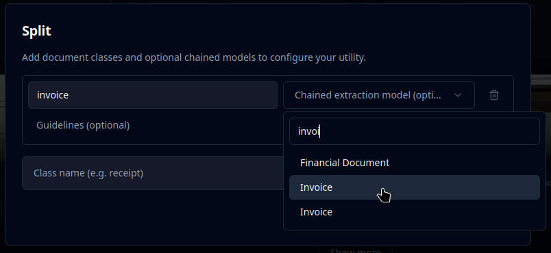
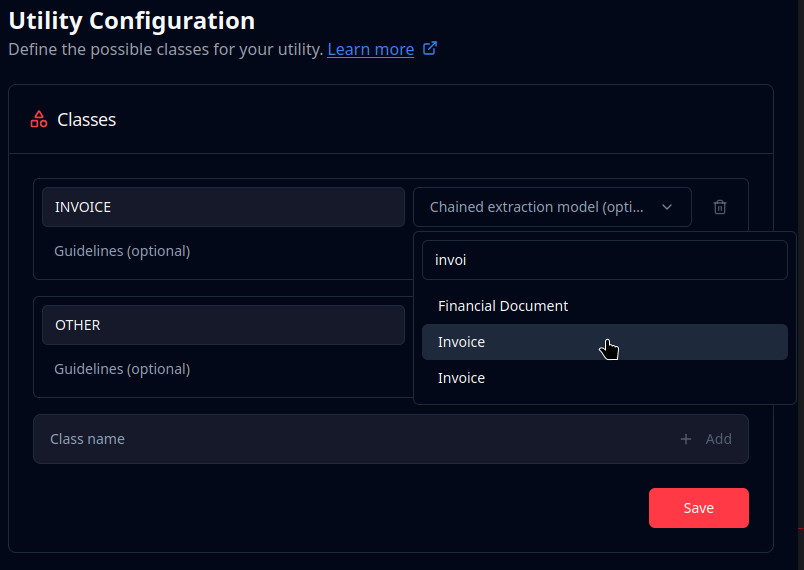

# Extraction Model Chaining

Use Split ranges to automatically extract document data, allowing for several different extractions on a multi-page file.

Note: Split Models also work on single-page files, in this case the range will always be exactly one page. If you need multiple extraction results on the same page, take a look at [Broken link](/broken/pages/dDgkS7gHL0rVCFqJERsZ "mention") instead.

## Extraction Set Up

### At Model Creation

When creating your Split model, you'll be adding document classes in the creation window.

For each document class, you can set one of your [Broken link](/broken/pages/ywb5XsDuWyBy07coiRb0 "mention") for chaining. The Extraction Model must exist prior to the Split Model creation.

Use the search field to filter available extraction models.

<figure><figcaption></figcaption></figure>

### After Model Creation

This works exactly like when creating at model creation.

Simply go to your Split model's "Utility Configuration" page and adjust as needed.

You can add new classes, remove classes, and change Extraction Models.

<figure><figcaption></figcaption></figure>

### Selectively Extracting

If a detected class has no linked Extraction Model, no extraction runs for that crop.

This allows selectively extracting some sections of the file while ignoring others.

Let's say you receive large multi-page PDFs from your users, where each PDF is a bundle of different scanned documents: plane tickets, travel receipts, driver license, and passport.

You need only the passports.

In your Split configuration, add a `passport` class and an `other`  class, and only link an extraction model to the `passport` class.

All split ranges will get classified, but only those linked to an Extraction Model will have extraction results.



#### Removing Unused Pages

It's also possible to remove pages that are never used in the Extraction. For example to remove terms and conditions from invoices, set up the classes `terms_and_conditions_page` and `invoice_page` , and only link an Extraction Model to the `invoice_page` class.

## Access Extraction Results

When an Extraction model is linked, each Split Range with the detected class will contain an Extraction Response object, which is identical when making an Extraction request for a single document.

Check the [split-result.md](sdk-integration/split-result.md "mention") section for more details.
