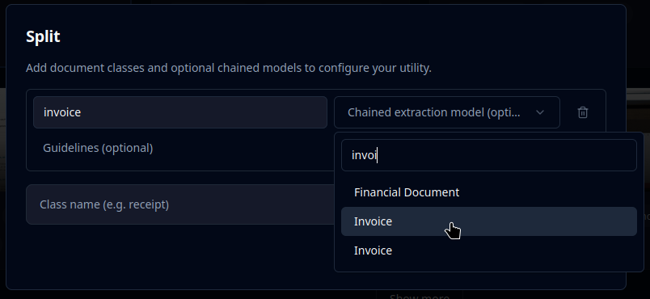
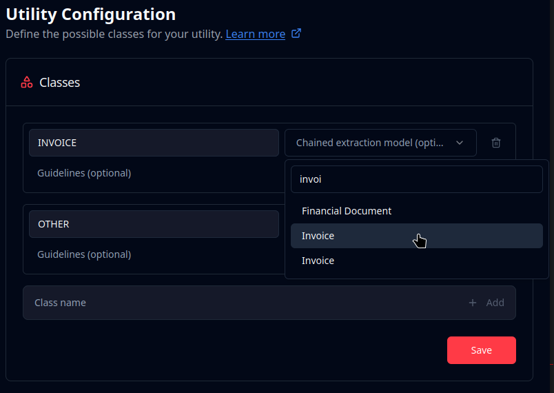

# Extraction Model Chaining

Use Split ranges to automatically extract document data, allowing for several different extractions on a multi-page file.

## Extraction Set Up

### At Model Creation

When creating your Split model, you'll be adding document classes in the creation window.

For each document class, you can set one of your [Extraction Models](https://app.gitbook.com/s/u5bStlX8nv4b9z4GXB2S/extraction-models "mention") for chaining. The Extraction Model must exist prior to the Split Model creation.

Use the search field to filter available extraction models.

<figure><figcaption></figcaption></figure>

### After Model Creation

This works exactly like when creating at model creation.

Simply go to your Split model's "Utility Configuration" page and adjust as needed.

You can add new classes, remove classes, and change Extraction Models.

<figure><figcaption></figcaption></figure>

### Selectively Extracting

If a detected class has no linked Extraction Model, no extraction runs for that split range.

This allows selectively extracting some sections of the file while ignoring others.

Let's say you receive large multi-page PDFs from your users, where each PDF is a bundle of different scanned documents: plane tickets, travel receipts, driver license, and passport.

You need only the passports.

In your Split configuration, add a `passport` class and an `other`  class, and only link an extraction model to the `passport` class.

All split ranges will get classified, but only those linked to an Extraction Model will have extraction results.



### Putting It All Together

#### Sample Use Case: KYC

As a sample use case, let's say you have a KYC workflow, and your users upload their files. Crucially, some users upload all their documents in a single multi-page PDF, while others send them in separate files.

As a result, you receive basically anything and everything mixed together in the pipeline. Some users upload single files with documents such as : driver licenses, passports, student IDs, employee badges, social security cards, etc. And on top of that, some users send multiple people's identity in single multi-page PDF files.&#x20;

As a first example, assume you only process passports. In your Split configuration, add a `passport` class and an `other`  class, then chain a [Passport extraction model](../use-cases/extraction-models/passport.md) on the `passport` class. Do not chain any models on the `other` class.

Another example, if you need only government IDs (so driver license and passport), you have two choices:

* Create an `official_government_id` class and chain it to an [International ID extraction model](../use-cases/extraction-models/international-id-card.md).\
  This is recommended if you accept a variety of ID documents.
* Create a `driving_license` and `passport` class and chain the [Driver's License](../use-cases/extraction-models/drivers-license.md) and [Passport](../use-cases/extraction-models/passport.md) extraction models to them, respectively.\
  This is recommended if you only accept specific ID documents.

As in the earlier example, do not chain any models on the `other` class.

In the above examples, the documents classified as `other` will **not** have extraction results, while those with specific classes **will** have results.

You can of course use **any** extraction model, including fully custom ones.

#### Sample Use Case: Removing Unused Pages

It's also possible to remove pages that are never used in the Extraction. For example to remove terms and conditions from invoices, set up the classes `terms_and_conditions_page` and `invoice_page` , and only link an Extraction Model to the `invoice_page` class.

This can speed up processing, as often terms and conditions pages are slower to process than regular invoice pages. You'll also save on Extraction costs, as detailed in the [token usage section](extraction-model-chaining.md#token-usage-with-chaining).

## Token Usage With Chaining



For Split models specifically, there can be multiple chained extractions on the same file. However, page ranges are non-overlapping, meaning the total number of pages processed cannot be greater than the total number of pages in the source document.

Detected page ranges not chained to an extraction model do not consume extraction credits.

Some examples:

* 2-page PDF file, a single 2-page document is detected and chained ⇒ 2 pages of Extraction credit consumed.
* 75-page PDF file, no documents detected ⇒ 75 pages of Split credit consumed.
* JPEG image file, a single document is detected and chained ⇒ 1 page of Extraction credit consumed.
* 23-page PDF file, a single 5-page document is detected and chained ⇒ 5 pages of Extraction credit consumed.
* 10-page PDF file, four 2-page documents are detected and chained, a single 2-page document is detected but **not** chained ⇒ 8 pages of Extraction credit consumed.

## Access Extraction Results

When an Extraction model is linked, each Split Range with the detected class will contain an Extraction Response object, which is identical when making an Extraction request for a single document.

Check the [split-result.md](sdk-integration/split-result.md "mention") section for more details.
