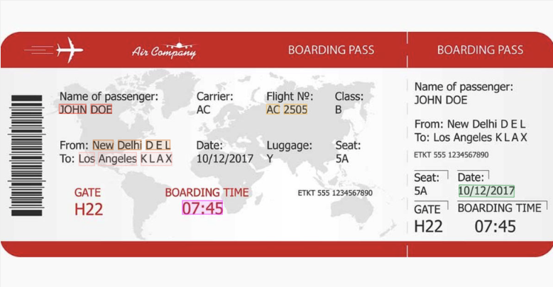

# Boarding Pass

## Why use Mindee for boarding passes?

Boarding passes differ depending on airline, format (paper or mobile), and layout. Instead of handling these variations yourself, you can simply tell the AI Agent which fields you want to extract, and it will design the model for you.

Common use cases:

* Travel and mobility apps verifying passenger details
* Loyalty program enrollment and automation
* Expense reporting and travel management

### What can be extracted from boarding passes?

Typical fields you may want to capture include:

| Field                       | Description                                   |
| --------------------------- | --------------------------------------------- |
| Passenger Name              | Full name of the traveler                     |
| Flight Number               | Airline code and flight number                |
| Departure Date              | Date of departure in YYYY-MM-DD               |
| Boarding Time               | Boarding time                                 |
| Departure Airport           | Name and IATA code of the origin airport      |
| Destination Airport         | Name and IATA code of the destination airport |
| Bardcode (Object Detection) | Image of the barcode                          |

Depending on your needs, you can also add fields such as **Seat Number**, **Gate**, or **Booking Reference (PNR)**.

Here is a boarding pass sample if you want to try a live test for your model:

<figure><figcaption></figcaption></figure>

## How to Create your Boarding Pass Model

Since there is no pre-trained boarding pass model in the catalog, you will need to build your own custom model using the AI Agent:

1. Describe what you want to the AI assistant (e.g. _“I want to capture passenger name, flight number, departure date, and airports from boarding passes. Also add an object detection field for the barcode zone.”_)
2. Optionally upload a sample boarding pass to give more context.
3. The Agent will generate a model for you and propose a set of fields.
4. You can refine the schema by asking for more or fewer fields until it matches your requirements.
5. Once ready, you can test the model live with your documents.

## Document format support

The custom model accepts PDF and common image formats (JPG, PNG). It works with digital boarding passes as well as photos or scans of printed passes.
