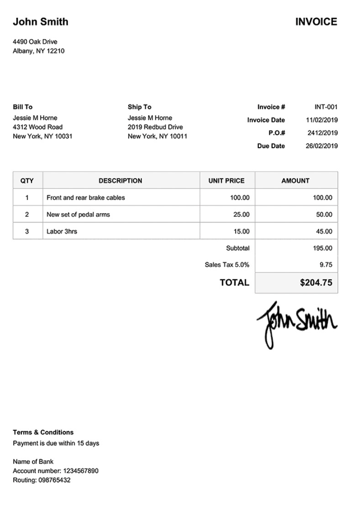

# Financial Document

Here is a quick demo on how to set up your Financial Document model:



## Why Use Mindee for Financial Documents?

### Unified processing for multiple financial document types

With the Financial Document model, you don’t need to build a separate parser for each kind of document.\
Invoices, bank statements, receipts, or even balance sheets can all be uploaded to the same endpoint.\
The model automatically interprets the type of document and extracts the relevant fields accordingly.

This allows you to:

* Centralize all your financial document workflows in one place
* Avoid managing multiple APIs for each document type
* Scale faster when new document formats appear in your processes

### Common Use Cases

You can use Mindee to extract structured data from:

* Invoices (supplier/customer name, totals, tax lines, due dates, etc.)
* Bank statements (account holder, IBAN, balances)
* Payment confirmations and receipts
* Account summaries or balance sheets
* Custom internal financial reports

## Two Ways to Get Started

### **1. Use the pre-trained Financial Document model (Recommended)**

* Go to the **Document Catalog** and select **“Financial Document.”**
* The model already includes standard fields such as invoice date, supplier name, totals and payment due date.
* You can use it as is, or ask the AI Agent to refine the schema by adding or removing fields.
* Once selected, you can test it immediately with your own documents.

### **2. Build a tailored Financial Document model with the AI Agent**

* If you need additional or non-standard fields (e.g. purchase order number, internal reference codes, bank account details), start a conversation with the Agent.
* Describe what you want extracted and optionally upload a sample document.
* The Agent will propose a schema, which you can refine until it matches your requirements.

You can use this financial document sample to do a live test yourself:

<figure><figcaption></figcaption></figure>

## Supported Formats

* **PDF files** — single-page or multi-page
* **Images** — JPG, PNG, TIFF, and more

See full [list of accepted files](https://docs.mindee.com/integrations/technical-limitations#accepted-files).


