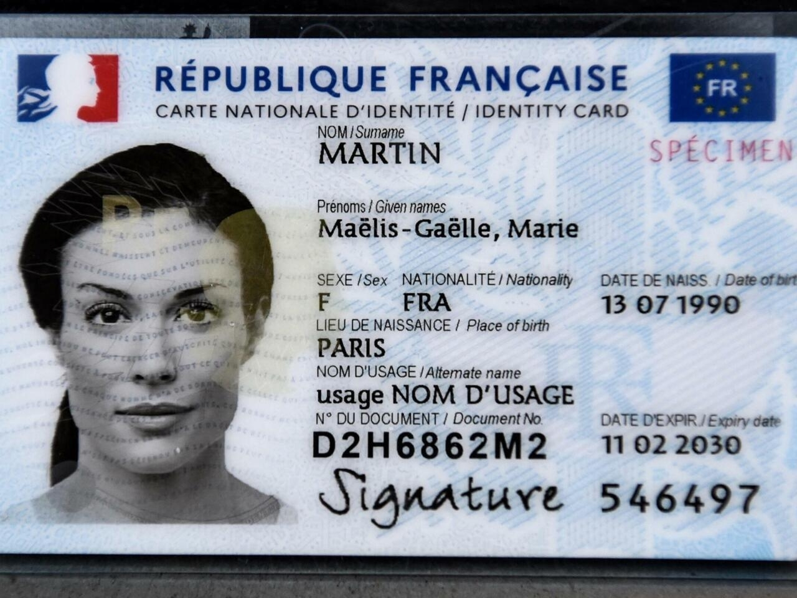

# International ID Card

Watch this short demo to see how quickly you can set up and test the French ID Card model with Mindee:



## Why use Mindee for ID cards?

ID cards differ vastly across countries in design, language, and layout. Mindee abstracts that complexity by offering:

* Pre-trained models ready for different document types
* Plug-and-play integration—no template design or training required
* High accuracy and speed, even with variations in card format, font, or photo quality

## What can be extracted from ID cards?

Mindee’s ID card API returns structured fields found on most ID documents:

| Field                  | Description                        |
| ---------------------- | ---------------------------------- |
| Document Type          | Type of ID (like national ID card) |
| Document Number        | Unique Identifier on the card      |
| Given Name(s), Surname | Personal name data                 |
| Birth Date             | YYYY-MM-DD format                  |
| Birth Place            | City or region of birth            |
| Issurance Date         | Card issue date                    |
| Expiry Date            | Expiration date                    |
| Gender                 | M/F/other options                  |
| Nationality            | Issuing country code               |
| MRZ Lines              | If present, machine-readable data  |
| Address                | (when applicable)                  |
| Additional metada      | Depends on region/document         |
| Signature              | Signature of the holder            |
| ID photo               | Photo of the holder                |

## Example: French National ID Card (Carte Nationale d’Identité – France)

### Why Mindee works for French ID Cards

Mindee’s ID Card France OCR model handles all French ID variations. It’s optimized to read both MRZ and non‑MRZ zones, ensuring high accuracy across all formats.

Mindee can extract specific French ID card fields like:

* **Card Access Number (CAN)** – a unique numeric code specific to French ID cards; not labeled on the document itself
* **Issuing Authority** – indicates the specific French administrative body (mairie, préfecture, etc.) that issued the card
* **Document Type** – classification indicating which version of the ID card it is (NEW - the issued version from 2021 or OLD - the issued version from 1988 - 2021)
* **Document Sides** – indicates whether the processed image is the front or back of the ID
* **Image Orientation** – rotation metadata indicating how the image was oriented during extraction

If you want to try and do a live test, you can use this French ID example:

<figure><figcaption></figcaption></figure>

### Two Ways to Start

#### 1. Pick the ID Card Model from the Catalog (Recommended)

* In your Mindee dashboard, go to the **Document Catalog** and choose the **“International ID”** model.
* Once selected, the platform will generate a prefilled schema with standard identity fields. You can accept that schema as is or adjust it in the **Data Schema** section to fine-tune what’s extracted.
* After the model is set up, you can immediately test it with your own documents.

#### 2. Build an ID Card Model from Scratch

* In the dialog with Mindee’s AI assistant, describe what the document is (e.g., “a French national ID card”) and specify the fields you want to extract (such as surname, date of birth, issuing authority).
* The AI will propose an initial schema—review it and adjust fields or mapping in the **Data Schema** tab until it fits your requirements.
* Once finalized, your custom model is ready for live testing.

## Document format support

The API handles both PDF and common image formats (JPG, PNG), including smartphone photos. It applies reliably to front/back sides and both old and new French ID layouts.


