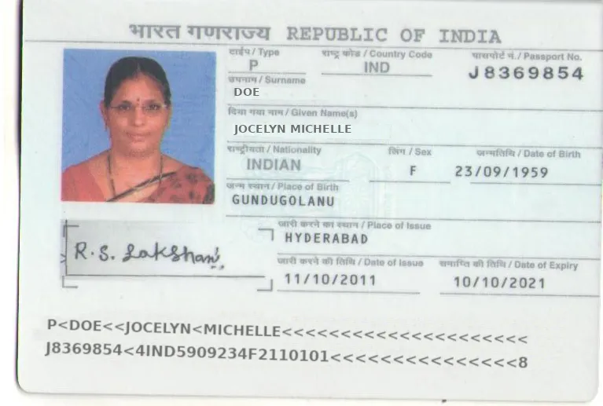
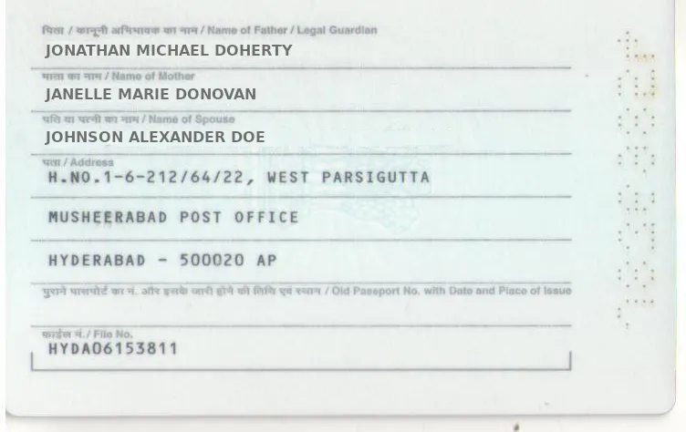

# Passport

Take a look at our demo for the Indian Passport model:



## Why Use Mindee for Passports?

Passports vary in format depending on the country, language, and issuance authority. Mindee simplifies extraction by letting you:

* Describe which fields matter to you
* Upload sample documents to refine extraction
* Get structured outputs without training models yourself

## Two Ways to Start Building your Passport Model

### 1. Choose "Passport" in the Catalog (Recommended)

* Click on "Create your document AI model" in your dashboard, then select **"Passport".**
* The Passport model template comes pre-configured with standard [#passport-fields](passport.md#passport-fields "mention").
* Once your Invoice model is created, you can immediately [test](../../models/live-test.md) with your own invoices.
* Optionally, you can adjust the model's [Data Schema](../../extraction-models/data-schema.md) if you need to modify fields.

### 2. Build a Passport Model from Scratch

* Ask the specifications directly to the AI assistant (e.g. "_I want a model that extracts the following fields from passports: surname, date of birth and MRZ_").
* Additionally, you can upload a sample passport if needed for clarification.
* Mindee builds you a tailored parser in seconds.

If you want to try and do a live test, here is a sample for Indian passport:

<figure><figcaption></figcaption></figure>

<figure><figcaption></figcaption></figure>

### Indian Passport Example

Indian passports include additional region-specific fields. If you're processing Indian passports, our technology is also able to extract, for example, those fields:

| Field                       | Description                                  |
| --------------------------- | -------------------------------------------- |
| Name of Legal Guardian      | Often the father’s name or guardian’s name   |
| Name of Spouse              | Appears if applicable                        |
| Name of Mother              | Optional field                               |
| Old Passport Number         | Prior document if applicable                 |
| Old Passport Date of Issue  | Issue date of prior passport                 |
| Old Passport Place of Issue | Location where the prior passport was issued |
| File Number                 | Government-issued file reference             |
| Address Line 1–3            | Full residential address                     |


You can just upload an Indian passport and ask to extract the fields present.


## Document Format

* We support both **single-page and multi-page PDFs/images of passports.**
* You can add the fields of any page in the data schema as they are all supported by Mindee.

## Passport Fields


