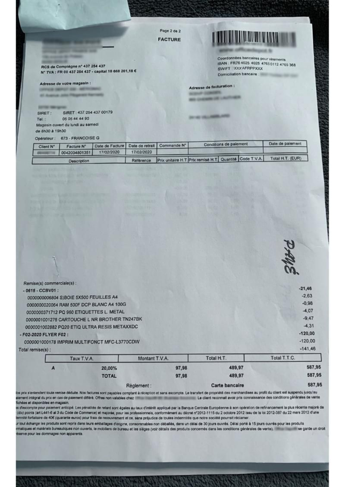

# Financial documents



## Why Use Mindee for Financial Documents?

Financial documents come in all shapes and formats, with layouts that vary significantly across countries, industries, and even vendors. Mindee’s AI agent helps you:

* Build custom extraction logic based on your documents
* Prompt the agent with the fields you need (e.g. “Extract invoice number, total amount, and due date”)
* Upload example documents to help the agent learn your document structure
* Skip complex rule-based templates or manual data entry

### Common Use Cases

You can use Mindee to extract structured data from:

* Invoices (supplier/customer name, totals, tax lines, due dates, etc.)
* Bank statements (account holder, IBAN, balances)
* Payment confirmations and receipts
* Account summaries or balance sheets
* Custom internal financial reports

## Example Fields You Can Extract

Depending on your document type, here are example fields our users often request:

| Document Type  | Possible Fields                                                                                                                |
| -------------- | ------------------------------------------------------------------------------------------------------------------------------ |
| Invoice        | Invoice number, date, supplier name, customer name, total (excl. VAT), VAT, total (incl. VAT), due date, currency              |
| Bank Statement | Account holder, IBAN, statement date/statement end date, opening/closing balance, transaction list (date, label, amount, type) |
| Receipt        | Merchant name, transaction date, payment method, item lines, subtotal, tax, total amount                                       |
| Balance Sheet  | Company name, statement date/statement end date, assets, liabilities, net equity                                               |

## Two Ways to Get Started

### **1. Use the pre-trained Financial Document model (Recommended)**

* Go to the **Document Catalog** and select **“Financial Document.”**
* The model already includes standard fields such as invoice date, supplier name, totals and payment due date.
* You can use it as is, or ask the AI Agent to refine the schema by adding or removing fields.
* Once selected, you can test it immediately with your own documents.

### **2. Build a tailored Financial Document model with the AI Agent**

* If you need additional or non-standard fields (e.g. purchase order number, internal reference codes, bank account details), start a conversation with the Agent.
* Describe what you want extracted and optionally upload a sample document.
* The Agent will propose a schema, which you can refine until it matches your requirements.

You can use this financial document sample to do a live test yourself:

<figure><figcaption></figcaption></figure>

## Supported Formats

* **PDF files** — single-page or multi-page
* **Images** — JPG, PNG, TIFF, and more
