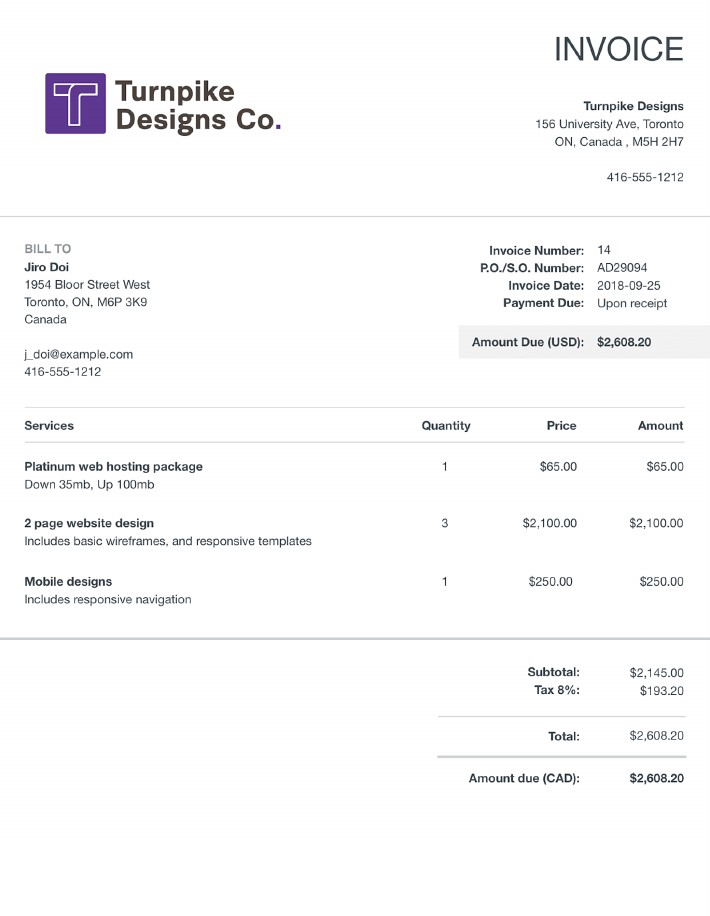

# Invoice

Watch our quick demo to see how you can easily set up your custom invoice model with Mindee:



## Why use Mindee for Invoices?

Invoices can vary widely by supplier, format, and layout. The Invoice model is designed to handle these differences, so you get consistent and reliable data extraction without custom development.

Common use cases:

* Accounts payable automation
* Expense and cost tracking
* Tax and compliance reporting

## Two Ways to Start Building your Invoice Model

### 1. Choose “Invoice” in the Catalog (Recommended)

* Open the **Document Catalog** in your dashboard and select **“Invoice.”**
* The model comes pre-configured with the standard financial fields listed above.
* You can start using it right away, or adjust the schema in **Data Schema** if you need additional fields.
* Once selected, you can immediately test the model with your own invoices.

### 2. Build a Custom Invoice Model with the AI Agent

* If your workflow requires extra fields (e.g. purchase order number, IBAN, payment terms), you can describe them directly to the AI Agent.
* Optionally upload a sample invoice for context.
* The Agent will generate a tailored schema that extends beyond the built-in Invoice parser.

You can use this invoice sample if you want to try and do a live test yourself:

<figure><figcaption></figcaption></figure>

## What can be Extracted from Invoices?

Here is the list of fields that are already in our pre-trained invoice model:

| Field                                                                                                                             | Type                   |
| --------------------------------------------------------------------------------------------------------------------------------- | ---------------------- |
| Supplier Name                                                                                                                     | `text`                 |
| Supplier Phone Number                                                                                                             | `text`                 |
| Customer Company Registration (number, type)                                                                                      | `array(object)`        |
| Supplier Company Registration (number, type)                                                                                      | `array(object)`        |
| Invoice Number                                                                                                                    | `text`                 |
| Date                                                                                                                              | `date`                 |
| Due Date                                                                                                                          | `date`                 |
| Payment Date                                                                                                                      | `date`                 |
| Total Amount                                                                                                                      | `number`               |
| Total Net                                                                                                                         | `number`               |
| Total Tax                                                                                                                         | `number`               |
| Taxes (rate, base, amount)                                                                                                        | `array(object)`        |
| Line Items (description, quantity, unit\_price, total\_price, product\_code, tax\_amount, tax\_rate, unit\_measure)               | `array(object)`        |
| Document Type                                                                                                                     | `classification`       |
| Locale (language, country, currency)                                                                                              | `object`               |
| Customer Name                                                                                                                     | `text`                 |
| Customer Address (address, street\_number, street\_name, po\_box, address\_complement, city, postal\_code, state/region, country) | `array(object)`        |
| Shipping Address (same components)                                                                                                | `array(object)`        |
| Billing Address (same components)                                                                                                 | `array(object)`        |
| Supplier Address (same components)                                                                                                | `array(object)`        |
| PO Number                                                                                                                         | `text`                 |
| Reference Numbers                                                                                                                 | `array(text)`          |
| Supplier Payment Details (IBAN, SWIFT/BIC, account\_number, routing/bank identifier)                                              | `array(object)`        |
| Supplier Website                                                                                                                  | `text`                 |
| Supplier Email                                                                                                                    | `text`                 |
| Customer ID                                                                                                                       | `text`                 |

Keep in mind that users can add their own fields or delete existing fields while reviewing the data schema.

## Document format support

The Invoice model accepts PDFs and common image formats (JPG, PNG). It works reliably with scanned, photographed, and digital invoices.

***
