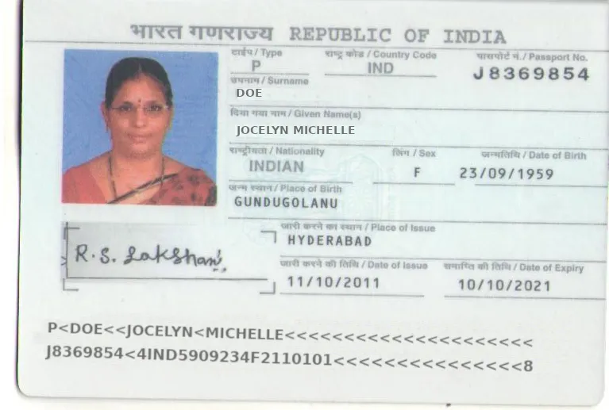
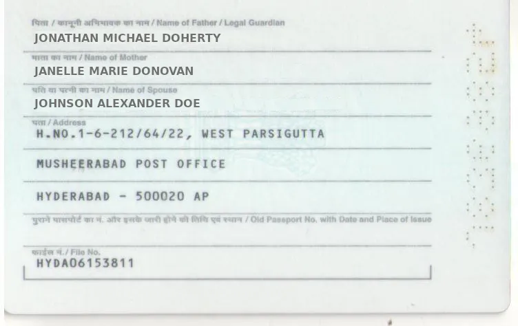

# Passport

Mindee enables automatic extraction of key identity fields from passport documents. Whether you are building a KYC process, onboarding flow, or document verification pipeline, our AI agent help you parse structured passport data with accuracy.

## Why Use Mindee for Passports?

Passports vary in format depending on the country, language, and issuance authority. Our AI agent simplifies extraction by letting you:

* Describe which fields matter to you
* Upload sample documents to refine extraction
* Get structured outputs without training models yourself

## What Can Be Extracted from a Passport?

Typical passport documents include a standard set of fields. Our AI agent can, for example, extract the following common fields for passports:

| Field             | Description                            |
| ----------------- | -------------------------------------- |
| Page Number       | Internal page number (if visible)      |
| Country Code      | Country of issuance                    |
| Identity Number   | Passport number                        |
| Given Name(s)     | First and middle names                 |
| Surname           | Last name                              |
| Date of Birth     | In the YYYY-MM-DD format               |
| Place of Birth    | City or region of birth                |
| Place of Issue    | Location where the passport was issued |
| Gender            | M / F / X                              |
| Issuance Date     | Passport issue date                    |
| Expiry Date       | Passport expiration date               |
| MRZ Row #1/Row #2 | Machine-readable zone lines            |

### Indian Passport Example

Indian passports include additional region-specific fields. If you're processing Indian passports, our technology is also able to extract, for example, those fields:

| Field                       | Description                                  |
| --------------------------- | -------------------------------------------- |
| Name of Legal Guardian      | Often the father’s name or guardian’s name   |
| Name of Spouse              | Appears if applicable                        |
| Name of Mother              | Optional field                               |
| Old Passport Number         | Prior document if applicable                 |
| Old Passport Date of Issue  | Issue date of prior passport                 |
| Old Passport Place of Issue | Location where the prior passport was issued |
| File Number                 | Government-issued file reference             |
| Address Line 1–3            | Full residential address                     |


You can just upload an Indian passport and ask the agent to extract the fields present—it will learn from your input.


If you want to try and do a live test, here is a sample for Indian passport:

<figure><figcaption></figcaption></figure>

<figure><figcaption></figcaption></figure>

## Two Ways to Start

### 1. **You Know the Fields You Need**

* Ask the specifications directly to the AI agent (e.g. "I want a model that extrats the following fields from passports : surname, date of birth and MRZ").
* Eventually upload a sample passport if needed for clarification.
* The agent builds a tailored parser in seconds.

### 2. **You’re Not Sure What Fields You Need**

* Ask the agent to show you **all extractable fields** from a passport document or by uploading a sample document.
* Explore and refine until you're satisfied.

This option is perfect if you're working with a new document format or you're still designing your data model.

## Document Format

* The AI agent supports both **single-page and multi-page PDFs/images of passports.**
* You can add the fields of any page in the data schema as they are all supported by our AI agent.
